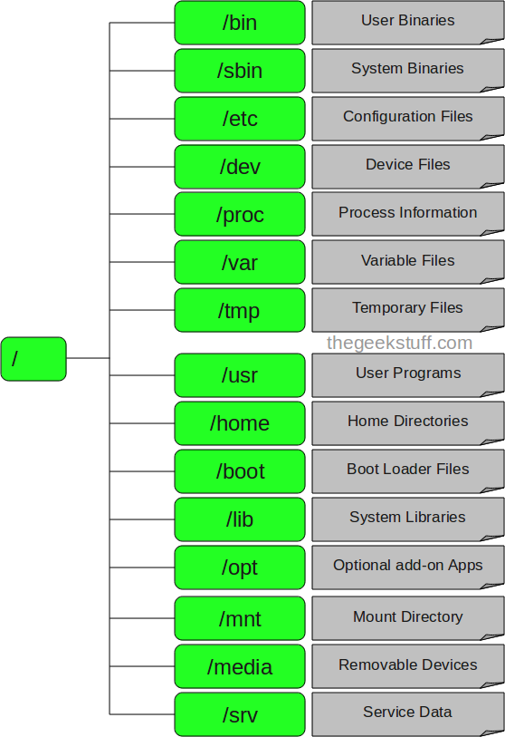
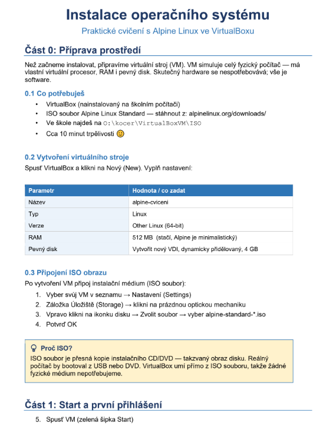
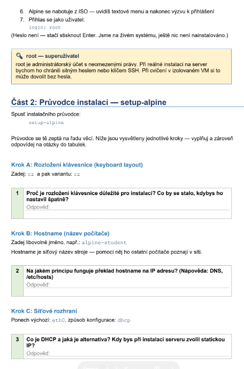
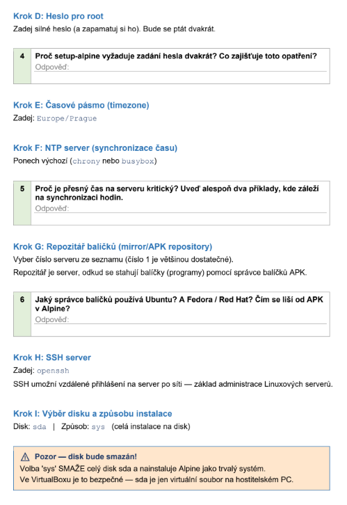
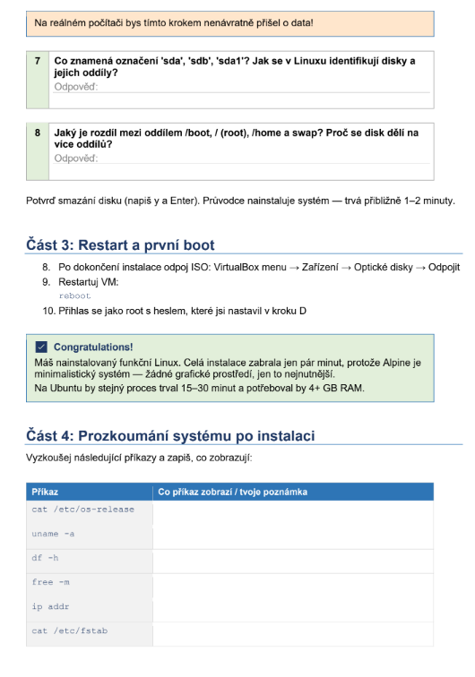
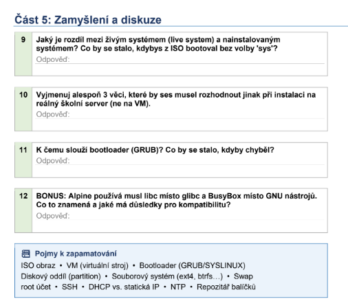

# 4. Instalace OS unixového typu

***Obsah otázky:*** ukázka virtualizace OS Unixového typu na PC. Instalace systému, popis systému. Souborové systémy, organizace souborového systému. CLI, GUI 

## Virtualizační software
- VirtualBox
	- multiplatoformový, open-source nástroj pro virtualizaci
	- **virtualizace** je proces, kdy se vytváří virtuální výpočetní prostředí namísto fyzického, často vytváří virtuální hardware, OS, atd
	- jeden PC/server může být rozdělen na několik virtuálních počítačů - snižuje počet využívaných serverů, spotřebu energie, náklady na infrastrukturu
	- Postup: Nový --> nastavení --> úložiště --> cd ikonka --> cd ikonka napravo --> choose/create a VOD --> vybrat .iso soubor --> run --> install
- Virtualizace umožňuje mít více OS na jednom zařízení.
- Nad virtuálním OS je hypervizor, podle toho se dělí virutalizace
	- Nativní - běží přímo na hardwaru
	- Hostovaný - běží jako aplikace

## OS unixového typu
- víceuživatelský multitasking OS s modulovým designem (= dělí systém do menších částí, "modulů", mohou být tvořeny, vyměňovány a upravovány)
- unixová filozofie = autor Ken Thompson, prosazuje minimalistický a modulový software development ("Do one thing and do it well")
- od svých předchůdců se liší tím, že byl jako první přenosný (napsán v C)
- hierarchický souborový systém (stromová str.), data ukládá jako "plain text"
- malé programy, které plní specifické úkoly - jejich propojení v shellu použitím "pipe" (|)
	- output jednoho programu je automaticky používán jako input druhého
- **výhody**: multitasking (proto využíván ve větších institucích, např. servery), efektivní využití paměti, sjednocený souborový systém (zařízení, programy a data se stávají soubory), vysoce přenosný
- **nevýhody**: ne-přátelské rozhraní pro nové uživatele, nutnost znát a rozumět hlavním vlastnostem, nutnost psát příkazy přesně a kontrolovat je
- **použití**: nejčastěji pro webové servery (multitasking, bezpečnost), databáze, cloud aplikace, zabezpečení cloudu (servery přístupné přes internet)
- unixový souborový systém: nejmenší jednotkou je **soubor** (obsahuje data) - soubory jsou ve **složkách** - složky jsou ve **stromové struktuře**
- Příkaz lze automaticky dokončit tabulátorem

| Příkaz  | Co to dělá         |
| ------- | ------------------ |
| ls (-l) | list files         |
| cd      | change directory   |
| mkdir   | make directory     |
| clear   | vyčistí cmd line   |
| cp      | kopírování souborů |
| mv      | přesun souborů     |
| rm      | mazání souborů     |

## Architekutra
- Hardware - nejnižší úroveň, fyzické komponenty počítače
- Kernel - komunikuje přímo s hardwarem, jádro operačního systému
- Shell - vrstva mezi kernelem a uživatelem
- User Space - uživatelské programy

## Souborové systémy na OS unixového typu
- používá se pro ukládání dat na disk, je to specifický způsob, ve kterém jsou data ukládána a umožňuje např. pojmenovávat soubory či stromovou strukturu
- FS na Linuxových systémech:
	- Extended File System (ext) - dnes verze ext4
	- Btrfs - snapshoty a copy-on-write (při vytvoření kopie se hned nevytvoří nová data, zkopírují se až když dojde k zápisu)
	- ZFS - podpora enormně velikých disků
- často podpora pro FAT32, NTFS, HFS+

## Rozhraní
### CLI
- Textové rozhraní, kde uživatel zadává textové příkazy - skrze program zvaný *shell* nebo *bash*
- Využití zejména na linuxových serverech
- Velmi efektivní a rychlé, ale nepřátelské pro nové uživatele

### GUI
- graphical user interface
- grafika není pevně součástí systému, ale skládá se ze Zobrazovacího serveru (vykreslování) a Desktopového prostředí, které se stará o funkcionalitu
- GNOME - ubutnu, moderní, KDE - Plasma - vysoká volnost, XFCE

## Organizace souborového systému
- na unixových systémech **je vše soubor nebo složka**

- souborové systémy se "mountují" do nějaké složky - hlavní disk se mountuje jako `/`, odnímatelné disky buď do `/mnt` nebo `/run/media`
- `/bin` obsahuje základní programy/příkazy OS jako /ls /pwd atd.
- `/boot` obsahuje soubory potřebné pro start počítače
	- často na jiném oddílu než zbytek systému

# INSTALACE

**1.** Klávesnice je klíčová při zadávání hesla pro `root`. Špatné rozložení (např. Z/Y) způsobí uložení jiného hesla a po restartu se do systému nedostaneš.

**2.** Překlad jména stroje na IP adresu se řeší primárně globálně pomocí **DNS** (-Domain name server), případně lokálně v textovém souboru `/etc/hosts`.

**3.** **DHCP** přiděluje IP adresy automaticky a dočasně. U produkčního serveru se ale volí **statická IP**, aby na něm běžící služby byly vždy dostupné na stejné, neměnné adrese.

**4.** V terminálu se při psaní hesla nezobrazují znaky. Dvojí zadání funguje jako ochrana před překlepem, kterým by ses mohl trvale uzamknout.

**5.** Přesný čas je nutný pro ověřování platnosti certifikátů (SSL/TLS), přesnou chronologii v systémových logách a fungování dvoufázového ověřování (2FA).

**6.** Ubuntu používá správce `APT`, Fedora `DNF`. Nástroj `APK` v Alpine je oproti nim extrémně minimalistický, což zásadně šetří místo na disku.

**7.** V Linuxu je hardware soubor. `sda` = první (`a`) fyzický disk (`sd`). Číslo značí oddíl. Tedy `sda1` je 1. oddíl na 1. fyzickém disku.

**8.** Disk se dělí z bezpečnostních a praktických důvodů. `/boot` nese jádro, `/` systém, `/home` data uživatelů a `swap` je virtuální RAM. Když se například přeplní `/home` daty, systém na `/` nespadne.

**Příkazy:**
* `cat /etc/os-release` - Zobrazí název a verzi distribuce.
* `uname -a` - Vypíše informace o jádru (Kernelu) a architektuře procesoru.
* `df -h` - Ukáže obsazenost disků a oddílů (čitelně v MB/GB).
* `free -m` - Zobrazí využití operační paměti a Swapu v megabytech.
* `ip addr` - Vypíše síťové karty a jejich IP a MAC adresy.
* `cat /etc/fstab` - Zobrazí tabulku disků, které se mají po startu automaticky připojit.

**9.** Živý (live) systém běží jen v operační paměti (RAM), po restartu se vymaže. Bez instalace na disk (volba 'sys') bys o všechno nastavení po vypnutí VM přišel.

**10.** Na fyzickém školním serveru by bylo potřeba: 1. Nastavit statickou IP. 2. Zajistit redundanci disků (RAID). 3. Nastavit mnohem přísnější zabezpečení (např. zákaz vzdáleného přihlášení pro root heslem, použití SSH klíčů).

**11.** Bootloader (GRUB) ihned po startu hledá a načítá jádro OS do paměti. Kdyby chyběl, systém by vůbec nenastartoval.

**12.** Náhrada těžké knihovny `glibc` (standartní knihovna C a C++) za odlehčený `musl` a `BusyBox` dělá Alpine extrémně malým. Nevýhodou je horší kompatibilita – programy kompilované pro běžný Linux (třeba Ubuntu) tu nemusí bez úprav fungovat.

**Pojmy k zapamatování:**
* **ISO obraz:** Přesná digitální kopie instalačního CD/DVD média v jednom souboru.
* **VM (virtuální stroj):** Softwarově simulovaný počítač se svým vlastním "virtuálním" hardwarem.
* **Bootloader (GRUB/SYSLINUX):** Zavaděč, tedy malý program, který fyzicky startuje operační systém.
* **Diskový oddíl (partition):** Logicky ohraničená a naformátovaná část jednoho fyzického disku.
* **Souborový systém (ext4, btrfs...):** Způsob a struktura, jakou se na disku organizují, ukládají a indexují data.
* **Swap:** Prostor na disku, kam si systém dočasně odkládá data, když mu dojde fyzická RAM.
* **root účet:** Účet absolutního administrátora (superuživatele) s neomezenými právy.
* **SSH:** Bezpečný a šifrovaný protokol pro vzdálené ovládání serveru přes příkazový řádek.
* **DHCP vs. statická IP:** DHCP rozdává adresy na síti automaticky, statická IP je pevně a ručně zadaná.
* **NTP:** Síťový protokol pro automatickou synchronizaci přesného času.
* **Repozitář balíčků:** Oficiální internetový sklad softwaru, ze kterého systém stahuje a instaluje aplikace.

- https://www.youtube.com/watch?v=LRx8QIzxsUQ