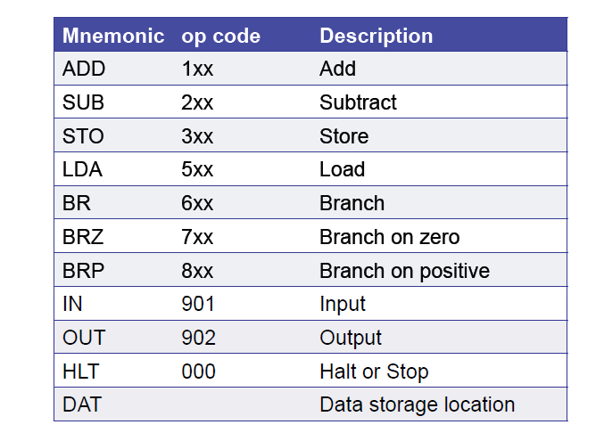
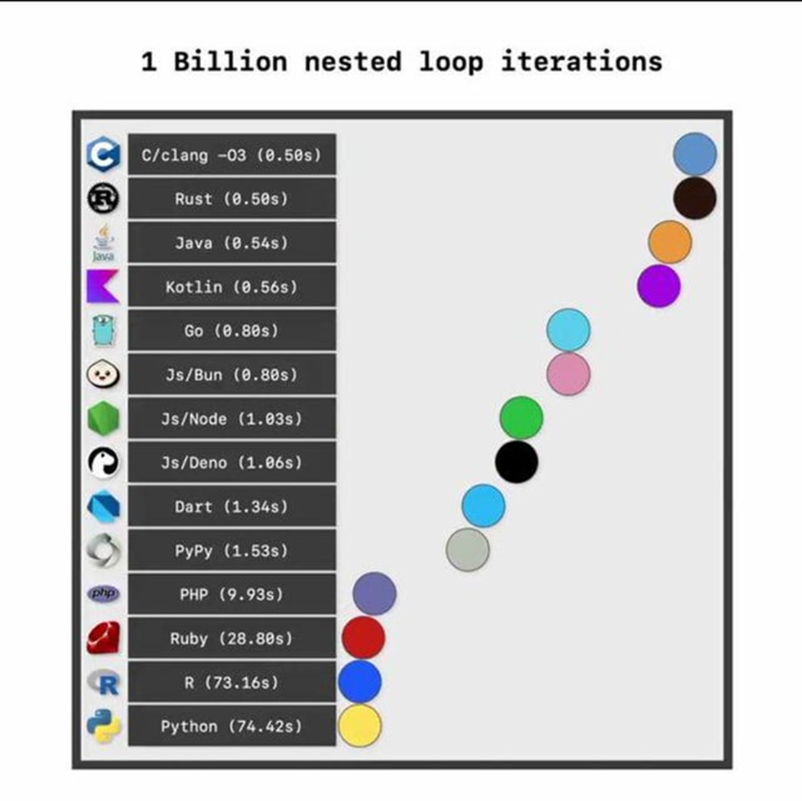

# 9. Počítačové jazyky

***Obsah otázky:*** reprezentace algoritmu pomocí programovacího jazyka; druhy počítačové jazyků; spojitost strojového kódu a programovacího jazyka, např. JSA v reálné či teoretické architektuře (LMC); příklady zápisu algoritmu v programovacím jazyku různé úrovně

# K čemu slouží programovací jazyk?
- Programovací jazyk = prostředek pro zápis algoritmů, jež mohou být provedeny na počítači
- Zápis algoritmu ve zvoleném programovacím jazyce se nazývá *program*
- Programovací jazyk je komunikačním nástrojem mezi programátorem, který v programovacím jazyce formuluje postup řešení daného problému, a počítačem, který program interpretuje technickými prostředky. Programovací jazyk je vlastně soubor pravidel pro zápis algoritmu, odborně řečeno se jedná o formální jazyk.

# Historie
- 40 léta - strojový kód pro počítač ENIAC
- 1957 - první jazyk Fortran a 1959 - Cobol
- 70 léta - vznik jazyka C, jako nástupce jazyka B. Velká revoluce - první vyšší úroveň jazyka
- 90 léta - populární jazyky GO, který je rychlý, ale není ještě mainstream


# Strojový kód x Programovací jazyk
- Strojový kód = Počítač "rozumí" pouze jednomu "jazyku", který je navržen pro zpracování procesorem, je zapsaný v binárním kódu
- Programy v programovacích jazycích jsou na ně překládány
- Jazyk symbolických adres - První úroveň abstrakce nad strojovým kódem, umožňuje do strojového kódu vkládat např. značky a data a na ty se pak odkazovat, tento jazyk musí poté tzv. assembler sestavit do čistého strojového kódu. Instrukce se již nepíší ve strojovém kódu, ale pomocí zkratek.
    - JSA si můžete vyzkoušet v teoretické architektuře LMC (little man computer) [zde](https://www.peterhigginson.co.uk/lmc/). Používá dekadickou soustavu a je tím jednodušší pro učení
    
    - ukázka sčítačky n čísel:

        ```text
        // HLAVNÍ PROGRAM
                INP          // Načti první číslo (n) od uživatele
                STA COUNT    // Ulož ho do proměnné COUNT (počítadlo smyčky)
        LOOP     LDA COUNT    // Nahraj aktuální stav počítadla do akumulátoru
                BRZ END      // Pokud je počítadlo 0, vyskoč ze smyčky na návěští END
                SUB ONE      // Odečti od počítadla 1
                STA COUNT    // Ulož novou hodnotu počítadla zpět do COUNT
                INP          // Načti další číslo od uživatele
                ADD SUM      // Přičti k němu dosavadní součet (uložený v SUM)
                STA SUM      // Výsledek ulož zpět do SUM
                BRA LOOP     // Skoč zpět na začátek smyčky (návěští LOOP)
        END      LDA SUM      // Nahraj celkový součet do akumulátoru
                OUT          // Vypiš ho na výstup
                HLT          // Ukonči program

        // DEKLARACE PROMĚNNÝCH A KONSTANT
        SUM      DAT 0        // Proměnná pro ukládání celkového součtu (výchozí 0)
        COUNT    DAT 0        // Proměnná pro počítadlo čísel (n)
        ONE      DAT 1        // Konstanta s hodnotou 1 pro odčítání
        ```

# Dělení programovacích jazyků
Dle míry abstrakce:
- *nízkoúrovňový* - svojí syntaxí se blíží stroji, JSA, (C)
    - rychlejší, ale nepřehlednější
    - lepší kontrola nad manipulací s pamětí
- *vysokoúrovňový* - svojí syntaxí se blíží člověku, Python, Java, (C++)

Dle způsobu překladu a spuštění:
- *kompilované* - před spuštěním jsou přeloženy kompilátorem, omezeny na jeden OS/architekturu, většinou bývají rychlejší
    - C, C++, Rust
- *interpretované* - nepřekládají se, ztrácí kvůli tomu rychlost
    - Python, Javascript, PHP
    - kompatibilní pro různá OS
    - překládané za běhu, interpretr je přeloží do bytecodu, který za běhu překládá virtual machine do strojového kódu
- tyto přístupy kombinuje např. Java, která kód kompiluje do Java Virtual Machine - pro spuštění potřebujeme JVM, ale interpretace tohoto kódu je rychlejší než interpretace zdrojového kódu

## Vliv na rychlost programovacích jazyků

# Příklady programovacích jazyků
- **C** - nízkoúrovňový strukturovaný jazyk, primárně se v něm vytváří software jako operační systémy, kompilátory, databáze nebo také programy pro hardware a embedded zařízení, např. v autech, a vychází z něj další jazyky; je velmi rychlý, ale složitý pro komplikovanější účely
- **C ++** - multiparadigmatický (jak strukturovaný, tak i objektově orientovaný) jazyk, vychází z jazyka C, používá se k programování výkonných programů jako např. her/herních enginů 
- **Python** - multiparadigmatický vysokoúrovňový interpretovaný jazyk, má jednoduchou syntaxi která značně urychluje a usnadňuje vývoj, vhodný pro začátečníky i pro profesionály, ztrácí ale kvůli interpretovanosti rychlost, proto se nevyužívá pro programy ve kterých záleží na výkonu; kvůli obrovskému množství knihoven (rozšíření) je velmi flexibilní a není v podstatě oblast, se kterou by si Python a jeho knihovny neporadily (např. TensorFlow, PyTorch pro AI, pandas pro tabulky, numpy pro výpočty...)

*Vyber si jeden programovací jazyk a vyjmenuj základní datové typy, které se v tomto jazyce používají*

Python:

### Základní datové typy

| Datový typ | Název a popis | Příklad | Mutabilita (Změnitelnost) |
| :--- | :--- | :--- | :--- |
| **int** | Integer (celé číslo). V Pythonu 3 nemá omezenou maximální velikost, závisí jen na paměti RAM. | `42`, `-5` | Neměnný (Immutable) |
| **float** | Float (desetinné číslo). | `3.14`, `-0.5` | Neměnný (Immutable) |
| **bool** | Boolean (pravdivostní hodnota). Nabývá pouze dvou hodnot s velkým počátečním písmenem. | `True`, `False` | Neměnný (Immutable) |
| **str** | String (textový řetězec). Znaky uzavřené v uvozovkách nebo apostrofech. | `"Ahoj"`, `'Svět'` | Neměnný (Immutable) |

### Kolekce (Strukturované datové typy)

| Datový typ | Název a popis | Příklad syntaxe | Mutabilita (Změnitelnost) |
| :--- | :--- | :--- | :--- |
| **list** | Seznam. Uspořádaná kolekce prvků. Může obsahovat mix různých datových typů. | `[1, "jablko", 3.14]` | **Měnitelný** (Mutable) |
| **tuple** | N-tice. Podobná seznamu, ale po vytvoření už do ní nelze přidávat ani z ní mazat prvky. Je paměťově efektivnější. | `(1, "jablko", 3.14)` | Neměnný (Immutable) |
| **dict** | Slovník. Kolekce párů *klíč: hodnota*. Slouží k mapování dat a rychlému vyhledávání podle klíče. | `{"jméno": "Petr", "věk": 30}` | **Měnitelný** (Mutable) |
| **set** | Množina. Neuspořádaná kolekce, která obsahuje pouze *unikátní* prvky (automaticky odstraní duplikáty). | `{1, 2, 3}` | **Měnitelný** (Mutable) |

C++

### Základní (primitivní) datové typy

| Datový typ | Popis | Obvyklá velikost |
| :--- | :--- | :--- |
| **bool** | Pravdivostní hodnota (0/1, false/true) | 1 byte (informace je 1 bit, ale v paměti zabírá 1 B) |
| **char** | Jeden znak (ASCII) | 1 byte |
| **short** | Menší celá čísla | 2 byty |
| **int** | Celá čísla v rozmezí (-2^31 až 2^31 - 1) | 4 byty |
| **unsigned int** | Celá čísla bez znaménka (pouze kladná, 0 až 2^32 - 1) | 4 byty |
| **long long** | Velká celá čísla | 8 bytů |
| **float** | Desetinná čísla (jednoduchá přesnost) | 4 byty |
| **double** | Desetinná čísla (dvojitá přesnost) | 8 bytů |

### Kontejnerové datové typy a řetězce (STL)

| Datový typ | Popis a vlastnosti |
| :--- | :--- |
| **string** | Textový řetězec (dynamické pole znaků `char`) |
| **vector** | Dynamické pole (prvky jdou za sebou v paměti, rychlý přístup přes index) |
| **list** | Obousměrný spojový seznam (rychlé vkládání a mazání kdekoli, ale pomalý přesun na index) |
| **deque** | Obousměrná fronta (rychlé přidávání a odebírání na obou koncích) |
| **queue** | Fronta (přístup FIFO - první dovnitř, první ven) |
| **priority_queue**| Prioritní fronta (prvky jsou automaticky řazeny podle nejvyšší/nejnižší hodnoty) |
| **set** | Uspořádaná množina unikátních prvků (typicky implementováno jako vyhledávací strom) |
| **unordered_set** | Neuspořádaná množina unikátních prvků (hashovací tabulka, rychlejší hledání než `set`) |
| **map** | Uspořádaný slovník klíč-hodnota (podobné `dict` v Pythonu, klíče jsou seřazené, bez hashování) |
| **unordered_map** | Neuspořádaný slovník klíč-hodnota (hashovací tabulka, neřadí klíče, ale má velmi rychlé vyhledávání) |