# 12. Počítačové sítě

***Obsah otázky:*** Druhy sítí (podle velikosti a topologie), model ISO-OSI a TCP/IP, bezpečností pravidla na sítích (vlastnosti hesla, anti-spyware, antivirové programy, firewall), IP adresy, příkazy pro zjišťování vlastností a konfigurace sítě daného uzlu, síťový HW (hub, switch, router, síťové karty). 

## Hlavní druhy sítí
### Podle velikosti
- **LAN** - local area network, skupina počítačů spojená na malém prostoru např. v jedné budově/kanceláři, použivá kabely, levné, rychlé, bezpečné
- **PAN** - personal area network, zařizovaná jedním člověkem, rozsah cca 10m, propojuje např. laptop, mobil, sluchátka, tiskárnu, atd.
- **MAN** - metropolitan area network, pokrývá větší oblasti, spojuje více LAN, používána mezi bankami, rezervace letenek, v armádě, ...
- **WAN** - pokrývá velká území (státy, kontinenty) spojuje MAN a LAN; internet, může být veřejná nebo soukromá, užívaná vládou, školstvím, byznys

### Podle topologie
1. **Sběrnicová (BUS)** = jeden souvislý kabel, ostatní zařízení se připojují pomocí spojek/odboček; jednoduché, levné, pomalé, problém = crash
2. **Kruhová (ring)** = stanice navzájem propojeny, nevznikají kolize, levné, zhroucení uzlu = crash
3. **Hvězdicová (star)** = skládá se ze samostatných kabelů vedoucí k hubu/switchi, porušení jednoho zařízení neovlivní fungování, vyšší spotřeba kabelů
4. **Stromová (tree)** = složena z několika hvězdicových propojených huby/switchi, používaná ve velkých firmách
5. **Síťová (mesh)** = každé zařízení je propojeno s každým, velká spolehlivost, spíše bezdrátové

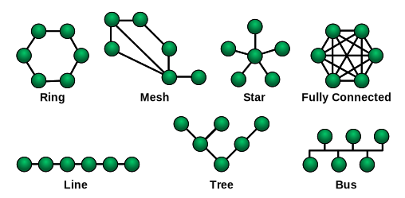


### Podle vzájemného vztahu stanic (uzlů)
1. **Peer-to-peer (P2P)**
	- všechny PC (uzly) si jsou rovny, někdy také "klient-klient"
	- každá stanice si může vyčlenit prostředek pro sdílení (tiskárnu, HDD, ...)
	- nelze centrálně spravovat; sdílení souborů v OS a na internetu, ...
2. **Klient-server**
	- jeden nebo více PC jsou nadřezeny ostatním klientům
	- server poskytuje služby klientům, mají serverový OS
3. **Model ISO/OSI**
	- počáteční sítě byly nekompatibilní, snaha o jednotný standard --> ISO (International Standard Organisation) vytvořili OSI (Open System Interconnection)
	- původně určeno pro WAN, ale funguje i pro LAN
	- 7 vrstev - každá vstva komunikuje se sousedními
	- soustředí se na spolehlivé služby, spolehlivost přenosu až do komunikační sítě --> musela být složitá, všechny vrstvy modelu zaměstnané
	
| vrstva      | funkce                                                                                                                                                                                                                             |
| ----------- | ---------------------------------------------------------------------------------------------------------------------------------------------------------------------------------------------------------------------------------- |
| aplikační   | tvoří rozhraní mezi programem a komunikačním systémem, např. HTTP, DNS, ...                                                                                                                                                        |
| prezentační | převádí formát dat do univerzální podoby, zajišťujezpůsob kódování, komprimace, kryptografie, ...                                                                                                                                  |
| relační     | navazuje relace mezi stanicemi, zajišťuje práva, hesla, ...                                                                                                                                                                        |
| transportní | zajišťuje přenos dat, přijímá je z relační vrstvy a rozkládá na pakety, případě chyby přenosu zajišťuje opětovné sestavení vstvy                                                                                                   |
| síťová      | zajišťuje adresování a směrování dat v síti od zdroje k cíli <br> přenosová cesta se buď dynamicky mění při průchodu packetů (datagramová služba - nespojová) nebo se cesta vytvoří na začátku spojení (spojově oriantovaná cesta) |
| linková     | zajišťuje přenos dat mezi propojenými stanicemi, vytváří rámce, které zabezpečují data proti chybám, poskytuje synchronizaci pro fyzickou vstvu                                                                                    |
| fyzická     | přenáší jednotlivé bity komunikačním kanálem, spojení může být dvoubodé - sériová linka nebo mnohobodé - ethernet, k přenostu dochází fyzicky kabelem - RJ45 konektor, UTP/STP ((un)shielded twisted pair) - kroucená dvojlinka - kroucení kvůli magentickému poli                                                                                                                  |

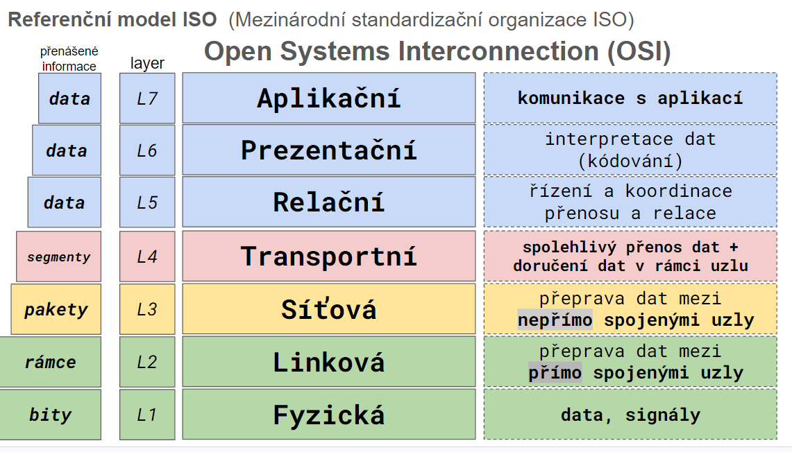

4. **TCP/IP**
	- vychází z ISO/OSI, původně vznikl pro komunikaci minsterstev v USA, dnes součástí všech OS (původně pro Unix), využíván ke komunikaci na internetu
	- nezávislý na přenosovém médiu, určen pro WAN, Lan, sériové linky, kabely, optické sítě, ...
	- má 4 vrstvy:
		 - aplikační (aplikační + prezentační + relační) - ajištěno aplikací/programem
		 - transportní - OS
		 - síťová - OS
		 - vrstva síťového rozhraní (linková + fyzická) - síťová karta
	- spolehlivost je problémem koncových uživatelů --> řešeno až na transportní vrstvě, méně spolehlivý, ale rychlejší a jednodušší

## Zapouzdření adres
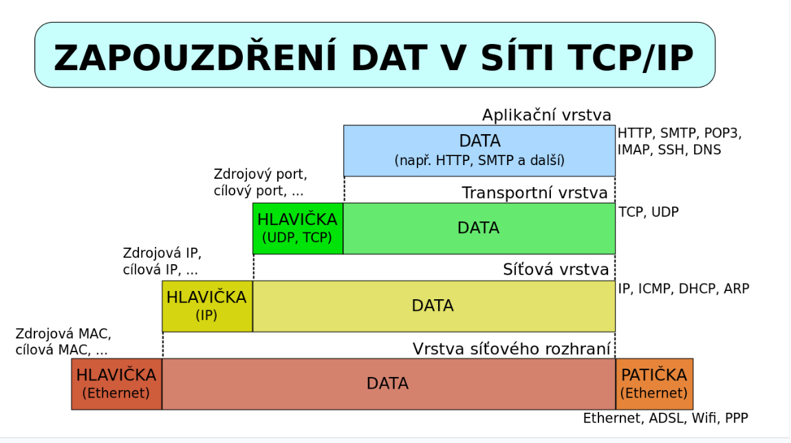
## Pojmy
- **IP adresa** = jednozančný identifikátor síťového rozhraní v počítačové síti, které používá IP protokol
	- IPv4 - 32bitové (4 byty) adresy, starší ale používanější, dávno došly
		- 127.0.0.1 - local host
		- 127.x.x.x - loop back
		- adresy privátních sítí: 10.x.x.x, 192.168.x.x, 172.16.x.x
	- IPv6 - 128bitové adresy, novější, dokáže pokrýt mnohem více adres
	- přidělovány celosvětovou agenturou IANA
		- WHOIS služba na hledání vlastníků IP adres
	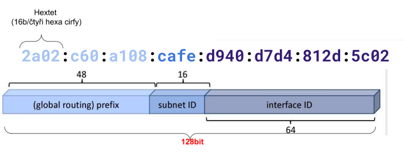
- **Síťový port** = speciální číslo, 0 až 65535 (2^16 - 1), které slouží v počítačových sítích při komunikaci pomocí protokolů TCP a UDP k rozlišení aplikace v rámci počítače
	- 80 - HTTP
	- 443 - HTTPS
	- 53 - DNS
	- 22 - SSH
	- 25 - SMTP (email)
	- **socket** = ip adresa + port
- **Mac adresa** = fyzická adresa, jednoznačný identifikátor síťového zařízení, přiřazován hned po výrobě
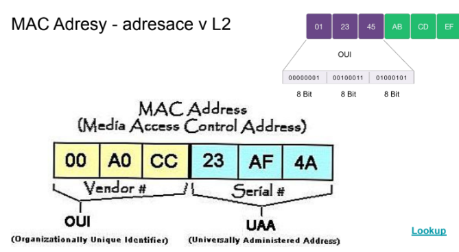
- **DHCP** = protokol pro automatickou konfiguraci PC připojených do sítě, přiděluje IP adresu, masku, ...
	- alternativou je ručně nastavit, nalzení pomocí cmd: ipconfig /all
		- IP adresu
		- IP adresu defeault gateway
		- masku sítě (subnet mask) - 32 bitové číslo, udává předěl mezi adresou sítě a zařízení v IPv4 adrese. Jsou to tedy prvně jedničky, pak nuly, tedy je možné ji zkrátit na číslo představující počet jedniček
		- DNS servery
- **DNS** = Domain Name System - převádí doménová jména na IP adresy a zpět
	- doména - samostatná administrativní skupina počítačů 
	- doménové jméno - přeložení IP adresy pomocí DNS
	- úrovně domén oddělené tečkou, domény prvního řádu - .cz, .com, .net
	- v ČR správce domén CZ.NIC
	- FQNH - (fully qualified domain name) www. - hostname, google - první úroveň, .com - tld 
	- 13 root serverů - decentralizace
- **NAT** = Network Adress Translation, zabraňuje komunikaci ostatních zařízení přes internet s lokálním PC
- **TCP** vs **UDP**
	- UDP - User Datagram Protocol
		- nespojovaný, nespolehlivý transportní protokol, vysílačky
	- TCP - Transmission Control Protocol
		- spojovaný, spolehlivý transportní protokol, telefonní linka
	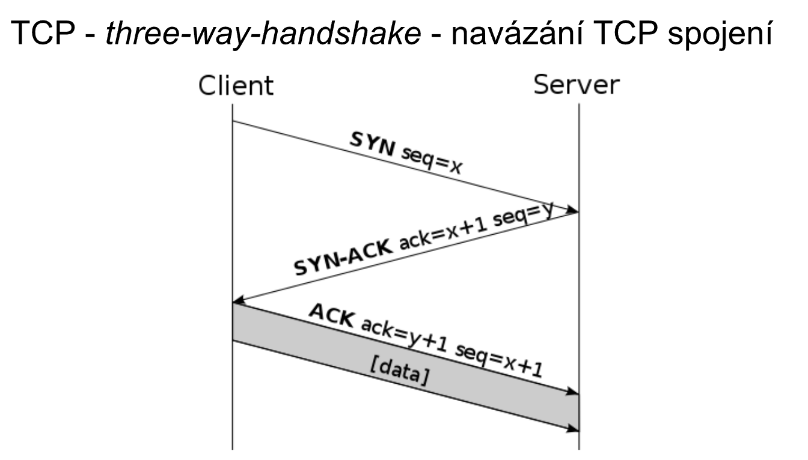
- **Ethernet** - komunikační technologie na úrvoni L1 a L2
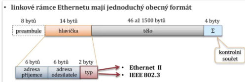

- **ICMP** - Internet control message protocol - kontrola připojení, příkazy ping a traceroute (tracert -d ip_adress pro windows)

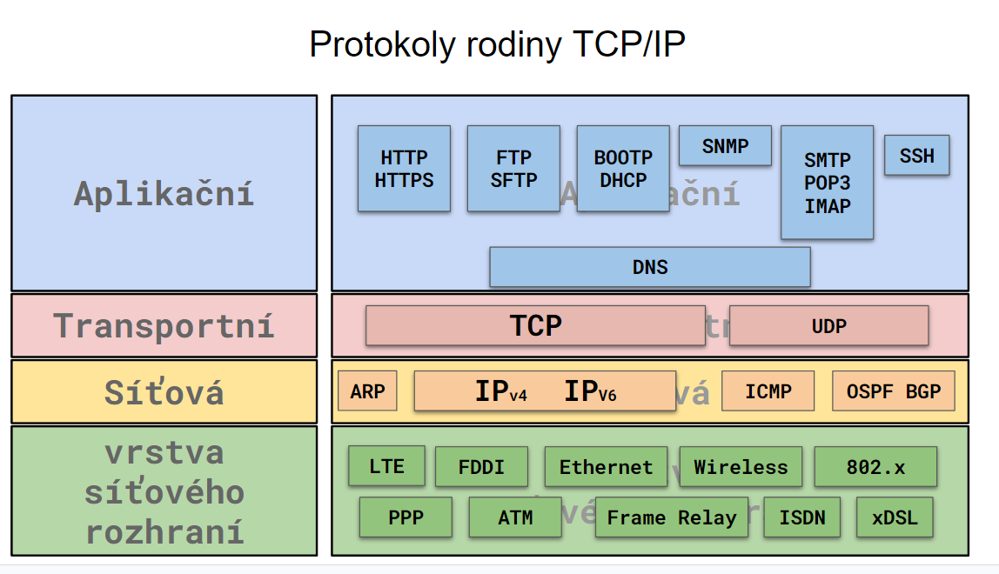
- HTTP/HTTPS - protokoly pro www, posílání protokolů pro komunikaci
	- má pevně danou strukturu
	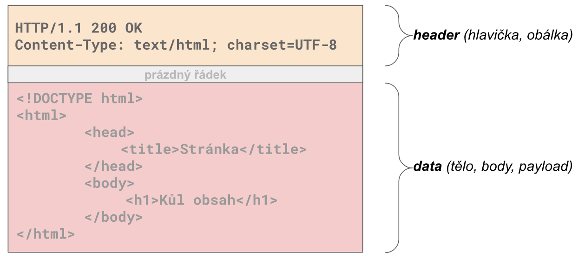
	- základní metodou je GET
	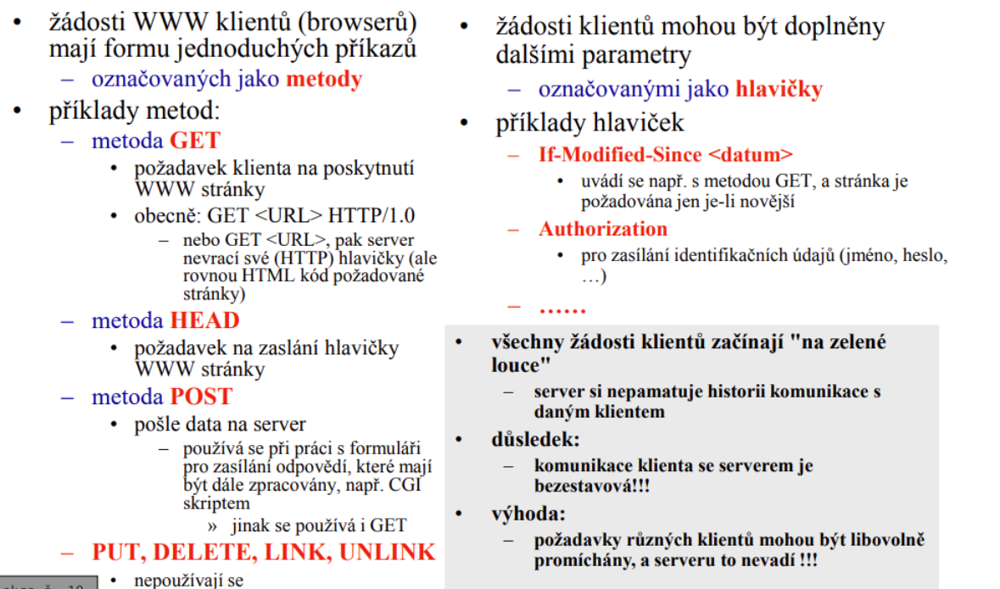
	- odpověď pokud je vše vpořádku je 200
	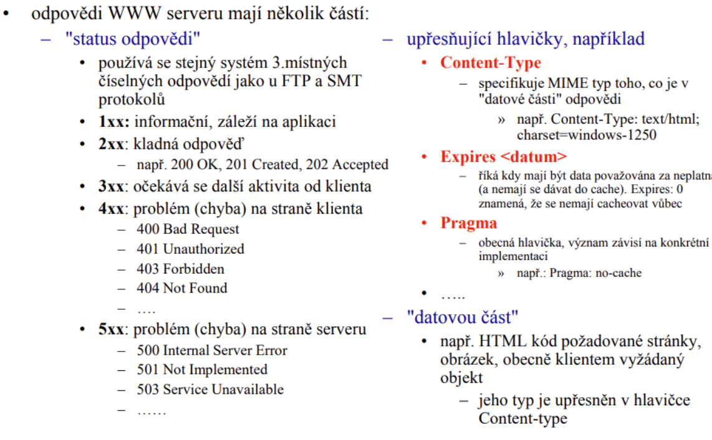
	Získání obsahu odpovědi se liší podle toho, co přesně ze serveru stahujeme. Knihovna `requests` nám k tomu nabízí tři základní vlastnosti/metody:

```python
import requests

# Odešleme jednoduchý GET požadavek
odpoved = requests.get("[https://jsonplaceholder.typicode.com/posts/1](https://jsonplaceholder.typicode.com/posts/1)")

# ==========================================
# 1. TEXT (odpoved.text)
# ==========================================
# Vrátí obsah jako klasický text (String). 
# Ideální, když stahuješ HTML kód webové stránky nebo obyčejný texták.
print("--- OBSAH JAKO TEXT ---")
print(odpoved.text)


# ==========================================
# 2. JSON (odpoved.json())
# ==========================================
# Pokud server vrací data ve formátu JSON (typické pro API), 
# tato metoda je rovnou převede na Python slovník (dict).
print("\n--- OBSAH JAKO JSON (SLOVNÍK) ---")
data = odpoved.json()
print(f"Získaný titulek: {data['title']}") # Můžeme s tím pracovat jako se slovníkem


# ==========================================
# 3. BAJTY / BINÁRNÍ DATA (odpoved.content)
# ==========================================
# Vrátí surová data v bajtech. 
# Tohle použiješ, pokud stahuješ soubory (obrázky, PDF, MP3 atd.), 
# které pak chceš zapsat a uložit na disk.
print("\n--- OBSAH V BAJTECH ---")
# Vypíše změť bajtů (b'{...\n  "id": 1,\n...')
print(odpoved.content) 

# Příklad uložení obrázku z bajtů:
# obrazek = requests.get("[https://adresa.cz/obrazek.png](https://adresa.cz/obrazek.png)")
# with open("muj_obrazek.png", "wb") as soubor:
#     soubor.write(obrazek.content)
```
- FTP/SFTP - přenos souborů
- SMTP, POP3, IMAP - emial

## Síťový hardware
- **Hub** = vše, co přijde na port, pošle na všechny ostatní porty (i když to pro ně není určené), nejjednodušší, nejlevnější, rychlé - v dnešní době nahrazovány switchi
- **Switch** = ví, jaký počítač je připojen na jakém portu --> posílá informace cíleně a ne všem; rychlejší
- **Router** = umí vše, co switch + DHCP + NAT, nejsložitější, bezpečný, použití při průchodu mimo LAN
- **Síťová karta** = komponenta, která připojuje počítač do sítě - Ethernet, WiFi...
	- Buď PCIe sběrnice, nebo USB dongle
	- Často vestavěna přímo v základní desce
	- WiFi - IEEE standard 802.11, verze odděleny písmenkem (např. 802.11be pro WiFi 7, což je standard pro 2024)

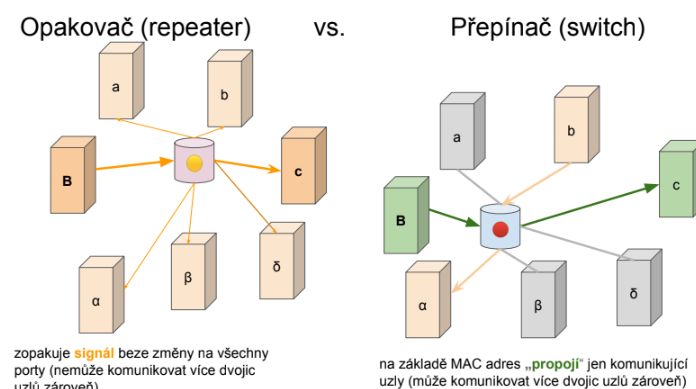
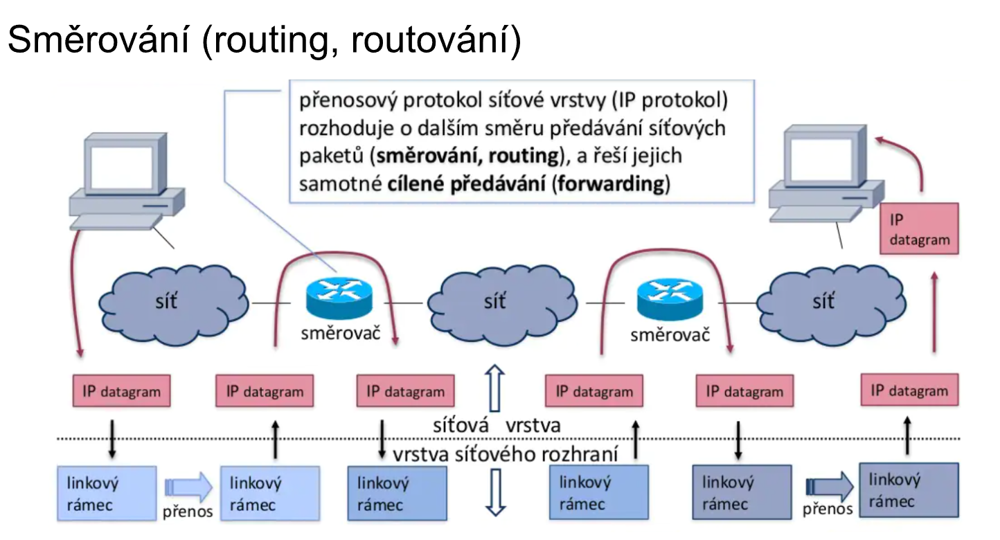
## Bezpečnost
- **Bezpečné heslo** = dostatečně dlouhé (alespoň 8 znaků), kombinace velkých a malých písmen, čísel, symbolů, častá změna hesel, vždy se odhlásit, nepoužívat jednoduchá hesla jako "qwerty", "password", "123456789" atd., nepoužívat samostatné slovo
- **Firewall** = zařízení síťové bezpečnosti, monitoruje příchozí a odchozí data, povoluje či blokuje příchozí data podle určitých pravidel; bariéra před hackery, malwarem atd.
	- není dobrá ochrana na úrovni IP, protože si lze IP adresy měnit, proto se dělají gates na aplikační úrovni
	- základní princip je odmítat všechna spojení z vnějšího internetu, ale pouštět ven z LAN
	- dělání děr do firewallu pro spojení zvenku, která chceme pustit pomocí port forwardingu
	- vše probíhá v NAT routeru, zastupující proxy server
	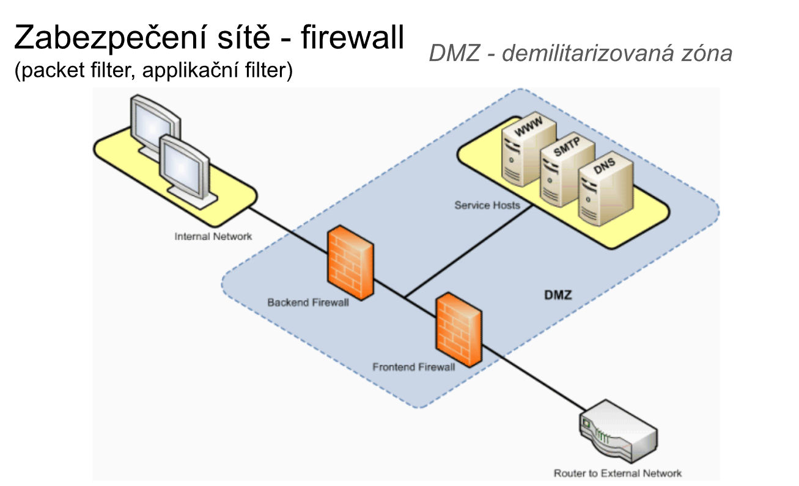


- **Šifrování** - navštěvování stránek s podporou SSL/HTTPS
- **Antivirus** = software, který chrání PC před viry, malwarem, např. Windows Defender, ESET, McAfee, Avast
- **Aktualizovaný OS** - chyby v OS jsou využívány hackery
- **VPN ** - zašifrování připojení mezi serverem a zařízením, dokáže také měnit IP adresu, abychom se mohli dostat na stránky dostupné jen v některých zemích 

## Příkazy pro zjištění konfigurace sítě
- `ipconfig` příp. `ipconfig <all>` - Windows příkaz, zjištění IP adresy, masky podsítě, default gate
- `netstat` - otevřené porty
	- Ve Windows taky `Perfmon /res`
- `ping <adresa>` - otestuje připojení k IP adrese či doméně
- `traceroute` (ve Windows `tracert`) - zjištění cesty k IP adrese či doméně
- `nslookup` - zjištění adresy pod doménou


## Ukázka komunikace pomocí LAN

Knihovna `socket` umožňuje nízkoúrovňovou síťovou komunikaci (nejčastěji přes protokol TCP/IP). Zatímco knihovna `requests` slouží primárně ke komunikaci s webovými servery (HTTP), sockety umožňují vytvořit přímé, obousměrné spojení mezi klientem a serverem a posílat si surová data (bajty).

Níže je ukázka jednoduchého klienta, který se připojí k serveru, odešle textovou zprávu a čeká na odpověď.

```python
import socket

# KROK 1: vytvoříme socket (AF_INET = IPv4, SOCK_STREAM = TCP)
klient_socket = socket.socket(socket.AF_INET, socket.SOCK_STREAM)

# KROK 2: definujeme IP a port serveru
host = "127.0.0.1" # Lokální adresa (localhost)
port = 5080

# KROK 3: připojíme se na server
klient_socket.connect((host, port))

# KROK 4: připravíme zprávu
zprava = "Ahoj z I2rob!" 

# KROK 5: odešleme zprávu (před odesláním se musí zakódovat do bajtů)
klient_socket.sendall(zprava.encode("utf-8"))

# KROK 6: příjem odpovědi. Parametr udává počet maximálně přijatých bytů
odpoved_bytes = klient_socket.recv(1024)

# KROK 7: dekódování odpovědi (z bajtů zpět na čitelný text)
odpoved = odpoved_bytes.decode("utf-8")

# KROK 8: zpracování odpovědi
print(odpoved)

# KROK 9: uzavření spojení (uvolnění prostředků)
klient_socket.close()
```

Aby náš předchozí klient mohl někam odeslat zprávu, potřebujeme server, který na daném portu naslouchá. Toto je ukázka tzv. "Echo serveru". Jeho úkolem je přijmout spojení od klienta, přečíst si jeho zprávu a tu samou zprávu mu jako ozvěnu (echo) poslat zpět. 

```python
import socket

# KROK1 a 2: vytvoříme socket a nastavíme
server_socket = socket.socket(socket.AF_INET, socket.SOCK_STREAM)
# Nastavení SO_REUSEADDR zajistí, že port nezůstane zablokovaný po vypnutí/restartu serveru
server_socket.setsockopt(socket.SOL_SOCKET, socket.SO_REUSEADDR, 1)

# KROK3: definujeme IP a port serveru
host = "127.0.0.1" # "0.0.0.0"
port = 5080

# KROK4 a 5: svážeme socket s IP adresou a čekáme
server_socket.bind((host, port))
server_socket.listen(1)

# KROK6: hlavní čekací smyčka na klienty
while True:
    # accept() zablokuje program a čeká, dokud se nepřipojí klient
    (klient_socket, adresa) = server_socket.accept()
    
    # KROK7: příjem dat od klienta
    zprava_bytes = klient_socket.recv(1024)
    
    # KROK8: dekódování odpovědi
    zprava = zprava_bytes.decode("utf-8")
    
    # KROK9: odeslani stejné zpravy
    odpoved = zprava
    
    # KROK9 (pokračování): odeslání echo odpovědi (z textu zpět na bajty)
    klient_socket.sendall(odpoved.encode("utf-8"))
    
    # KROK10: uzavření spojení s klientem a ve smyčce čekáme na další spojení
    klient_socket.close()
```