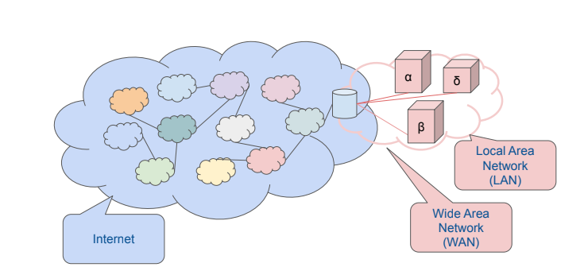
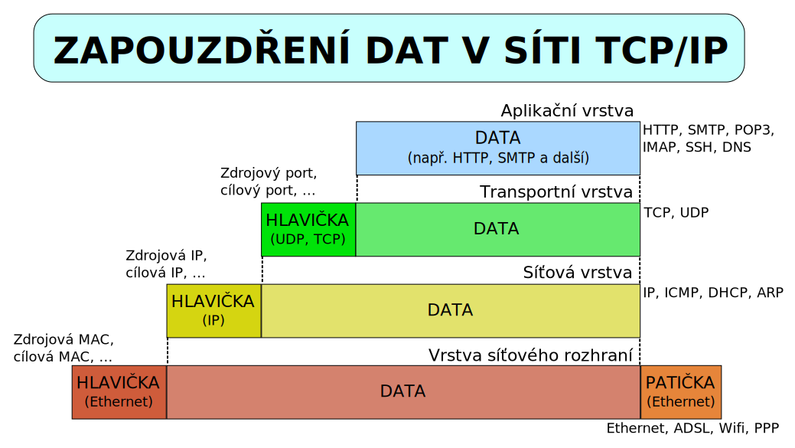

# 13. Internet

***Obsah otázky:*** Princip činnosti, TCP/IP, služby a historie internetu, práce s www prohlížečem, vyhledávání informací na internetu (katalogy a vyhledávače). Ochrana autorských práv a osobních údajů.

## Co je to Internet a princip jeho fungování

- **Internet** (s velkým I) = celosvětový systém **navzájem propojených počítačových sítí** ("síť sítí"). Jedná se o globální hardwarovou a softwarovou infrastrukturu.
- **internet** (s malým i) = obecný termín pro jakékoliv propojení více počítačových sítí (např. v rámci jedné nadnárodní firmy).
- **Model komunikace (Klient - Server):** Internet primárně funguje na tomto modelu.
    - **Server:** Výkonný počítač neustále připojený k síti, který nabízí služby a data (např. webový server s webovou stránkou).
    - **Klient:** Zařízení uživatele (PC, mobil) a jeho software (webový prohlížeč), které vznáší dotaz (požadavek) na server. Server požadavek zpracuje a odešle klientovi odpověď.
- **Paketový přenos dat:** Data necestují vcelku. Tok dat je rozdělen na menší části (tzv. **pakety**). Každý paket může putovat k cíli jinou cestou (směrování/routing). V cíli se pakety opět spojí do původního souboru.

## Historie Internetu
- **60. léta** - myšlenka *decentralizované* a *robustní* sítě. Vznikla v USA za **Studené války** jako reakce na strach z prvního přeletu sovětského Sputniku (dobytí vesmíru) a hrozbu jaderného útoku. Centralizovaná síť by po zničení centra spadla, decentralizovaná nikoliv.
    - Finanční prostředky poskytla grantová agentura ministerstva obrany USA **(D)ARPA** (Defense Advanced Research Projects Agency).
    - Podle této agentury byla první síť pojmenována jako **ARPANET**.
- **konec 60. let** - první uzly této sítě byly umístěny většinou na **vyspělých univerzitách**. Došlo k prvnímu úspěšnému spojení 4 velkých univerzit.
- **70. léta** - vznik rodiny protokolů **TCP/IP**.
    - Vyvíjeli jej Vint Cerf a Bob Kahn.
    - Zajišťuje, aby spolu mohly komunikovat počítače různých značek a platforem. Řeší vysílání a provoz mezi uzly.
    - Vzniká IP verze 4 - označení počítače v síti čtyřmi 8bitovými čísly (např. 192.168.1.1).
- **80. léta** - ARPANET přechází z původního protokolu NCP na TCP/IP.
    - Oddělení sítě MILNET (armádní složka) od ARPANETu (akademická složka).
    - Vzniká **DNS** *(Domain Name System)*. Lidé si špatně pamatují číselné IP adresy, DNS proto přiřazuje IP adrese srozumitelný textový název - doménu (např. seznam.cz).
    - Zmenšují se počítače (nástup PC) a dostávají se do bank, firem a domácností.
- **1989** - vzniká **WWW** *(World Wide Web)* - systém prohlížení, ukládání a odkazování dokumentů (hypertext).
    - Vytvořil jej **Tim Berners-Lee** v evropském středisku CERN (vytvořil základy: jazyk HTML, protokol HTTP, adresaci URL).
- **1992** - Oficiální připojení ČR k internetu na ČVUT (Jan Gruntorád, linka do Vídně).
- **1993** - NCSA Mosaic - první grafický webový prohlížeč, který zpopularizoval web.
- **1996** - CESNET - propojení univerzit v ČR.
- **1998** - Vzniká Windows 98, internet se dostává masivně do mainstreamu domácností.
- **90. léta a vývoj připojení** - Zpočátku pomalé *dial-up* připojení (vytáčené přes pevnou telefonní linku, účtováno za čas, blokovalo hovory) -> přechod na *ADSL* (asymetrické, neblokovalo telefon) -> kabelový internet -> optické sítě -> rychlé mobilní sítě (4G, 5G).
- **Prohlížečové války:** Windows začal integrovat Internet Explorer přímo do OS. Netscape byl placený a lepší, ale Microsoft díky monopolu Windows vyhrál. Z jádra Netscape však později vzešla Mozilla Firefox.

## TCP/IP (Princip činnosti)
- Odvozen od teoretického modelu ISO/OSI (který má 7 vrstev). Model TCP/IP má 4 vrstvy.
- Internet potřebuje protokoly TCP/IP k tomu, aby komunikace (výměna dat) probíhala bez chyb a mezi správnými počítači.
- Je to rodina (sada) protokolů pro komunikaci v počítačové síti.

### 1. Vrstva síťového rozhraní (Linková)
- Přístup k fyzickému přenosovému médiu. Převádí data na elektrické/optické signály.
- Technologie: Wi-Fi, Ethernet, optika.
- Identifikace pomocí **MAC adresy** = fyzická (skutečná) adresa síťové karty, jednoznačně přiřazena při výrobě hardwaru.

### 2. Síťová vrstva (Internetová)
- Pracuje v operačním systému. Jejím úkolem je bezpečně doručit data (pakety) mezi nepřímo spojenými počítači. Souvisí s tím **směrování** (hledání nejlepší cesty přes routery).
- Identifikace pomocí **IP adresy** = logická adresa zařízení v síti.

### 3. Transportní vrstva
- Zajišťuje přenos dat tak, aby nenastala chyba.
- Rozděluje data na menší segmenty, čísluje je a na druhé straně je skládá (protokol **TCP** - spolehlivý, s potvrzováním doručení, nebo **UDP** - rychlý, ale bez záruky doručení, např. pro streamování videa).

### 4. Aplikační vrstva
- Zajišťuje komunikaci samotných aplikací (prohlížečů, e-mailových klientů) s uživatelem.
- Používá protokoly jako HTTP/HTTPS (web), SMTP (e-mail), FTP (soubory).

## Služby internetu a práce s webem

- **Rozdíl mezi Internetem a WWW:**
    - *Internet* je fyzická a logická infrastruktura (kabely, routery, IP adresy). Zahrnuje vše.
    - *WWW (World Wide Web)* je pouze **jedna ze služeb**, která na Internetu běží. Je to soubor propojených hypertextových dokumentů (webových stránek).

### Hlavní služby internetu
- **WWW (HTTP/HTTPS):** Prohlížení webových stránek.
- **E-mail (SMTP, POP3, IMAP):** Elektronická pošta, asynchronní komunikace.
- **FTP:** Přenos souborů mezi počítači.
- **DNS:** Překlad doménových jmen (seznam.cz) na IP adresy (77.75.75.172).
- **VoIP / Videokonference:** Přenos hlasu a obrazu přes internet (Skype, Teams, Discord).
- **Cloudová úložiště:** Ukládání a zálohování dat na vzdálených serverech (Google Drive, OneDrive).

### Práce s WWW prohlížečem a URL
- **Prohlížeč (Browser):** Program (Chrome, Edge, Safari), který stáhne zdrojový kód webu (HTML, CSS, JS) a vykreslí ho do grafické podoby srozumitelné uživateli.
- **Části prohlížeče:** Adresní řádek, navigační tlačítka (zpět, vpřed, obnovit), zobrazovací plocha, záložky (bookmarks), rozšíření (add-ons).
- **URL (Uniform Resource Locator):** Jednotný lokátor (adresa) zdroje. Říká prohlížeči, kde přesně data najít.
    - Příklad: `https://www.skola.cz:443/dokumenty/rozvrh.pdf`
    - `https://` -> Protokol (zajišťuje šifrovaný přenos)
    - `www.skola.cz` -> Doménové jméno
    - `:443` -> Port (často se nepíše, prohlížeč ho doplní automaticky)
    - `/dokumenty/rozvrh.pdf` -> Cesta ke konkrétnímu souboru na serveru

### Vyhledávání informací
- **Katalogy (dříve dominantní, např. starý Seznam.cz):** Weby jsou tříděny lidmi (administrátory) do logických stromových struktur a kategorií (např. *Zábava -> Filmy -> Komedie*). Nevýhodou je pomalost přidávání nových webů.
- **Vyhledávače (dnes dominantní, např. Google, Bing):** Používají roboty (crawlers/spiders), kteří automaticky procházejí internet, indexují texty webů a při dotazu uživatele seřadí výsledky podle složitých algoritmů (relevance, kvalita).
- **Pokročilé vyhledávání:**
    - `"Přesná fráze"` - vyhledá slova přesně v tomto pořadí a tvaru (v uvozovkách).
    - `filetype:pdf` - vyhledá pouze soubory určitého typu (např. PDF dokumenty k nějakému tématu).
    - `site:cvut.cz` - omezí vyhledávání pouze na konkrétní doménu.
    - `-slovo` - (mínus před slovem) vyloučí z výsledků stránky obsahující toto slovo.

## Ochrana autorských práv a osobních údajů

### Jak zákony ČR chrání autory (Autorský zákon č. 121/2000 Sb.)
- Autorské právo **vzniká automaticky** samotným vytvořením díla (napsáním kódu, vyfocením fotky). Není nutná žádná registrace ani symbol ©.
- Práva se dělí na:
    - **Osobnostní:** Právo rozhodnout o zveřejnění, právo být uveden jako autor. Nelze se jich vzdát a nelze je prodat.
    - **Majetková:** Právo dílo užívat, rozmnožovat, prodávat a poskytovat k němu licence. Lze je převést na jinou osobu/firmu. Trvají po dobu života autora a 70 let po jeho smrti (pak se z díla stává volné dílo).

### Ochrana obsahu a Licenční politika
- Obsah na internetu (software, obrázky, hudba) je často pod **Licencí** - smlouvou, která stanovuje, co s obsahem smíme a nesmíme dělat.
- Časté požadavky: uvedení autora, omezení komerčního použití, zákaz vytváření derivátů.

### Druhy SW licencí
- **Komerční SW (Proprietary):** Kód je uzavřený, za používání se platí.
- **Open Source Software:** Program poskytovaný zdarma i se zdrojovým kódem. Uživatelé ho mohou studovat, upravovat a dále šířit.
- **Freeware:** Software s používáním zcela zdarma. Autor si nenárokuje odměnu, ale kód je obvykle uzavřený a software nelze prodávat dál.
- **Shareware:** Software zdarma na zkoušku (omezeno časově, např. na 30 dní, nebo omezeno funkcemi). Pro plnou verzi je nutné zaplatit.
- **Volné dílo (Public domain):** Nejsou zde chráněna majetková práva. Může je používat, měnit a prodávat kdokoliv.
- **EULA (End User License Agreement):** Ujednání s koncovým uživatelem. "Ten dlouhý text, co nikdo nečte při instalaci." Upravuje odpovědnost výrobce a práva uživatele.
- **Creative Commons (CC):** Sada standardizovaných licencí často používaná pro obrázky a texty na internetu (určuje pravidla typu: "lze sdílet, ale jen nekomerčně a s uvedením jména").

### Etické chování a ochrana osobních údajů
- **Zásady vzhledem k autorskému právu:**
    - Nestahovat z internetu a nepoužívat obrázky/hudbu bez prokazatelného souhlasu nebo správné licence (využívat např. fotobanky zdarma jako Pixabay).
    - Při citování cizího textu vždy uvést zdroj.
    - Neprovádět softwarové pirátství.
- **Zásady vzhledem k ochraně osobních údajů (vč. nařízení GDPR):**
    - Sdílet na sociálních sítích jen to nejnutnější (žádné fotky občanských průkazů, letenek s čárovými kódy, adresy bydliště).
    - Zveřejňovat fotografie jiných osob (kamarádů na sociálních sítích) pouze s jejich souhlasem.
    - Používat silná, unikátní hesla a dvoufázové ověřování (2FA).
    - Chápat, že co se jednou dostane na internet, lze jen velmi těžko vzít zpět ("digitální stopa").