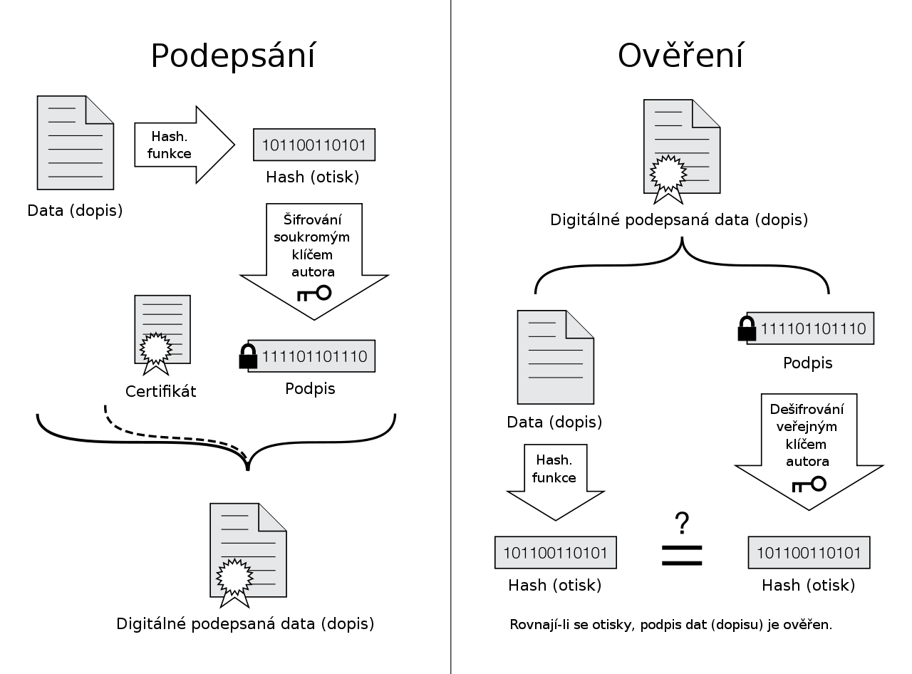
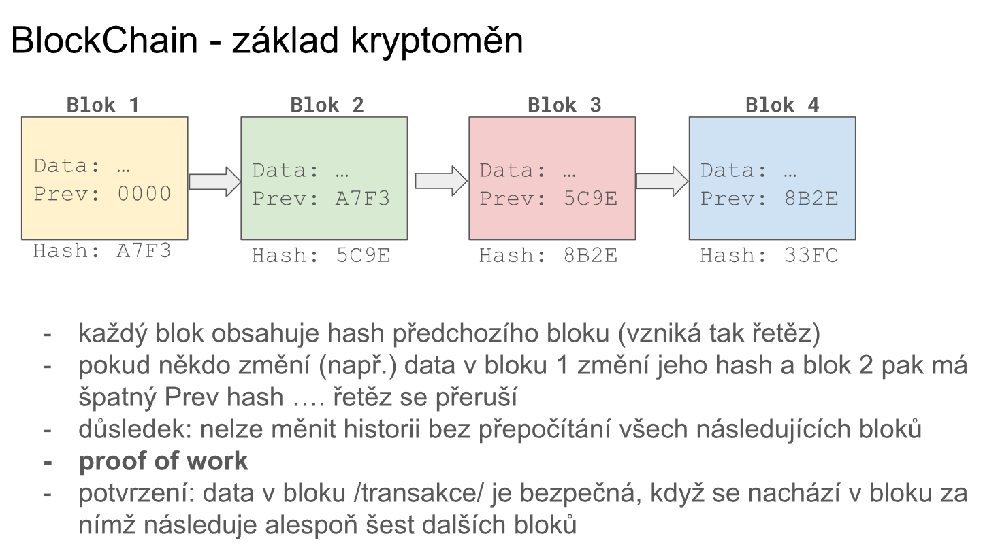

# 14. Bezpečné digitální prostředí

***Obsah otázky:*** digitální identita a její vazby s fyzickou identitou – datová schránka, elektronický podpis, token; neověřená a falešná digitální identita; nevědomá digitální stopa – logy, metadata, cookies, sledování uživatele a narušení soukromí při využívání internetu; vědomá digitální stopa – virtuální osobnosti a jejich cílené vytváření; fungování a algoritmy sociálních sítí

## Digitální identita a její použití
- **Digitální identitou** rozumíme data uložená na počítači, která reprezentují jednotlivce nebo organizaci na internetu.
- Je tvořena různými informacemi: jméno, e-mailová adresa, telefonní číslo apod.
- Tři způsoby potvrzení totožnosti (autentizace):
    - **Něco, co víme** (heslo, PIN)
    - **Něco, kým jsme** (biometrie – otisk prstu, scan obličeje)
    - **Něco, co vlastníme** (bezpečnostní token)
        - = fyzické nebo virtuální zařízení, které potvrzuje identitu.
        - Např. 2FA (dvoufázové ověření) aplikace v mobilu, fyzický USB token (YubiKey).
- **Datová schránka:** Online úložiště garantované státem pro zabezpečenou komunikaci a výměnu dokumentů mezi občany, firmami a úřady. Má stejnou právní váhu jako doporučený dopis s pruhem.
- **Falešná digitální identita:** Není potvrzena nebo ověřena, může být úmyslně používána k anonymním, podvodným nebo nelegálním aktivitám (tzv. catfishing, scamy).

---

## Šifrování a Elektronický podpis
Pro fungování digitálních identit a bezpečného přenosu dat je naprosto klíčové šifrování (kryptografie). Dělíme ho na dva základní typy:

### 1. Symetrické šifrování
- K šifrování i dešifrování zprávy se používá **jeden a tentýž klíč**. Příkladem může být například ans = klíč XOR zpráva (Vernamova šifra)
- **Výhody:** Je velmi rychlé a výpočetně nenáročné, ideální pro šifrování velkých objemů dat (např. celého pevného disku).
- **Nevýhody:** Zásadní problém s distribucí klíče. Jak bezpečně předat klíč druhé straně přes internet, aby ho nikdo neodposlechl? (Příklad algoritmu: AES).

### 2. Asymetrické šifrování (např. RSA)
- Využívá **pár matematicky provázaných klíčů**:
    - **Veřejný klíč (Public Key):** Je volně dostupný komukoliv. Slouží k zašifrování zprávy (nebo k ověření podpisu).
    - **Soukromý klíč (Private Key):** Musí být přísně tajný a bezpečně uložený (např. na hardwarovém tokenu). Slouží k dešifrování zprávy (nebo k vytvoření podpisu).
- **Princip RSA:** Založen na matematické složitosti rozkladu velkých čísel na prvočísla (faktorizace). Pokud něco zašifruji veřejným klíčem, dešifrovat to jde **pouze** příslušným soukromým klíčem.
- **Výhody:** Řeší problém distribuce klíčů – veřejný klíč mohu poslat klidně veřejně na billboardu.
- **Nevýhody:** Je velmi pomalé a výpočetně náročné (proto se v praxi kombinuje se symetrickým – asymetricky se bezpečně pošle symetrický klíč a zbytek komunikace už jede symetricky).
- **Hashování** - funkce, která dokáže pro libovolný vstup vytvořit nějaký výstup, většinou číslo. Musí být deterministická a naprosto náhodná (podobné vstupy vrací velmi rozdílné hashe). Není možné na základě hashe vypočítat vstup. Způsob ukládání hesel.
    - **SHA2** - nejběžnější používané, spolu s MD5, ale ta je nebezpečná
    - využití v datových strukturách, jako hash mapy

```python
import hashlib

message = "Moje tajná zpráva"

# vytvoření hashe
hash = hashlib.sha256(message.encode("utf-8"))

# tisk hashe
print(hash.digest()) # vypíše binárně
print(hash.hexdigest().upper()) # vypíše jako string (hex)
```


### Elektronický podpis a jeho ověření
Elektronický podpis umožňuje ověřit identitu odesílatele a ochránit dokument proti úpravě či padělání (zajišťuje integritu a nepopiratelnost).
- Z dokumentu se nejprve vytvoří otisk (hash). Odesílatel tento hash zašifruje svým **soukromým klíčem** = vzniká elektronický podpis.
- Příjemce vezme **veřejný klíč** odesílatele a podpis dešifruje. Pak sám vytvoří hash dokumentu. Pokud se oba hashe rovnají, dokument nikdo nezměnil a odesílatel je pravý.
- Příklady takového softwaru: GnuPG, OpenSSL.



### Elektronický podpis a jeho ověření
Elektronický podpis řeší tři hlavní problémy: **autenticitu** (víme, kdo to poslal), **integritu** (víme, že se obsah cestou nezměnil) a **nepopiratelnost** (autor nemůže tvrdit "to jsem neposlal já").

**Jak přesně to funguje a kde se bere hash?**
1. **Vytvoření hashe (otisku):** K vytvoření podpisu se používá *hashovací funkce* (např. algoritmus SHA-256). To není nic, co bys musel složitě programovat nebo stahovat. Je to standardizovaný matematický vzorec, který je automaticky zabudovaný v běžných programech (např. Adobe Acrobat pro PDF, e-mailoví klienti, nebo nástroj OpenSSL). Program odesílatele "prožene" dokument touto funkcí a vypadne z něj unikátní řetězec znaků (hash). *Důležitá vlastnost hashe: Stačí změnit jediné písmenko v původním dokumentu a výsledný hash se kompletně změní.*
2. **Zašifrování hashe (samotný podpis):** Program odesílatele následně vezme tento vytvořený hash a zašifruje ho pomocí **soukromého klíče** odesílatele. Tento zašifrovaný hash se připojí k dokumentu – a to je ten samotný elektronický podpis.

**Jak mám garanci, že do dokumentu nikdo nesáhl?**
Představ si, že útočník zachytí dokument cestou a přepíše v něm fakturovanou částku z 1 000 Kč na 9 000 Kč.
- Aby podvrh prošel, musel by útočník vytvořit nový hash (odpovídající částce 9000 Kč) a znovu ho zašifrovat odesílatelovým soukromým klíčem. Jenže **útočník soukromý klíč nemá**, takže to nedokáže.
- Když dokument dorazí k tobě, tvůj program vezme **veřejný klíč** odesílatele a dešifruje jím přiložený podpis. Tím získá původní hash (např. `ABC`), který vytvořil odesílatel.
- Následně tvůj program sám pomocí stejné hashovací funkce spočítá nový hash z přijatého (útočníkem změněného) dokumentu. Vyjde mu např. `XYZ`.
- Program porovná obě hodnoty (`ABC` a `XYZ`). Protože se nerovnají, okamžitě vyhodí červenou chybu: **"Dokument byl pozměněn nebo je podpis neplatný!"** Garancí je tedy samotná matematika asymetrické kryptografie. Útočník zkrátka neumí vytvořit platný podpis pro změněný dokument.


### Certifikace a Certifikační autority (CA) v ČR
Celý ten proces výše má jeden háček: Jak víš, že ten **veřejný klíč**, kterým podpis ověřuješ, opravdu patří například "Janu Novákovi"? Co když si útočník vytvořil vlastní pár klíčů a ten veřejný prostě jen pojmenoval "Jan Novák"?
- K řešení tohoto problému slouží **Certifikát**. Je to v podstatě "digitální občanka", která pevně a prokazatelně spojuje konkrétní veřejný klíč s konkrétní fyzickou osobou nebo firmou.
- Tuto občanku nevydává ledajaký program, ale nezávislá, důvěryhodná třetí strana = **Certifikační autorita (CA)**. Ta nejprve (např. na pobočce pomocí skutečného občanského průkazu) spolehlivě ověří tvoji identitu a teprve pak ti certifikát na tvůj klíč vydá. CA tento tvůj certifikát navíc digitálně podepíše svým vlastním "super-klíčem", kterému systémy (např. Windows nebo prohlížeče) od výrobce automaticky důvěřují.
- **Kdo to dělá v ČR:** Aby měl elektronický podpis právní váhu při komunikaci se státem (tzv. kvalifikovaný elektronický podpis podle evropského nařízení eIDAS), musí certifikát vydat státem uznaná certifikační autorita (kvalifikovaný poskytovatel služeb vytvářejících důvěru). V ČR v současnosti působí tři hlavní subjekty:
  1. **PostSignum** (provozováno Českou poštou)
  2. **První certifikační autorita, a.s. (I.CA)**
  3. **eIdentity a.s.**

### Praktická ukázka: Ověření podpisu pomocí OpenSSL
Nejprve získáme certifikovaný veřejný klíč (u kterého CA zaručila, komu patří), který nám umožní dešifrovat nápovědu s příkazem (např. soubor `public.pem`):

```text
-----BEGIN PUBLIC KEY-----
MIIBIjANBgkqhkiG9w0BAQEFAAOCAQ8AMIIBCgKCAQEAuyLsA73zcoy0QERwYdO8
iG6nRkyGT+i1YUke4Uz8qgA9mruFLTNfxJlwwqcc6fpz87Yq+nM9LiR0lk6P7+tF
qo8U1QD7pkNW1tT5rqYZxw1OeZ5bj4+yhmb+7tD6RftFB5mqtW5eH0HrQV7mLsY0
JOxVDogtMRK7jn6e13zOoRXiocrNygsSLYG9zb8soelb8dZ1CiAdbN+0BslPobA6
KN16RScjCWV4H7j8Qg8QNSu7TbIgh7Q569jOnnpHyJx6yo7s9MmJdg8w/EJofrbr
Vr99mOI3TUWLpSYv7XUgzL8tOg0PxcsvhqjS60rq3Tp60cUx1RwdnycOq7uoRfzj
ewIDAQAB
-----END PUBLIC KEY-----
```

K ověření použijeme nástroj OpenSSL a postupujeme takto:
**1. Krok: Získání hashe z podpisu (dešifrování veřejným klíčem)**
```bash
openssl rsautl -verify -pubin -inkey public.pem -in dokument.sig -hexdump
```
*Výstupem je hexadecimální reprezentace původního hashe, který vytvořil odesílatel:*
`41 3f b8 2b e6 c3 bc c6-a5 49 90 bf 3e 19 92 a1`
`c9 88 e6 16 fc 4d d0 8f-ac 83 7c 1e 0d 45 76 b5`

**2. Krok: Vytvoření vlastního hashe ze samotného dokumentu**
```bash
openssl dgst -sha256 dokument.txt
```
*Výstupem je námi spočítaný hash přijatého textového dokumentu:*
`41 3f b8 2b e6 c3 bc c6-a5 49 90 bf 3e 19 92 a1`
`c9 88 e6 16 fc 4d d0 8f-ac 83 7c 1e 0d 45 76 b5`

**3. Krok: Porovnání**
Z porovnání obou výstupů plyne, že **hashe jsou naprosto stejné**. Tedy elektronický podpis je pravý a soubor nebyl cestou nijak pozměněn.

Tímto zabezpečením se vyhneme takzvanému Man in the middle útoku
---

## Blockchain a Kryptoměny (Decentralizovaná identita)
Na principech asymetrického šifrování a hashování stojí i moderní technologie blockchainu.
- **Blockchain:** Je to v podstatě distribuovaná (decentralizovaná) účetní kniha, kterou sdílí tisíce počítačů po celém světě. Data zapsaná do blockchainu (např. transakce) jsou chráněna kryptograficky – jakmile je blok zapsán a zřetězen s předchozím, nelze ho zpětně smazat ani upravit.
- **Kryptoměny (Bitcoin, Ethereum):** Využívají blockchain jako nezávislou platební síť.
- **Vazba na identitu:** Ve světě kryptoměn neexistují uživatelská jména a hesla jako u banky. Tvá digitální identita a vlastnictví prostředků jsou reprezentovány čistě tvým **soukromým klíčem** (tzv. krypto peněženkou). Tvůj "účet" je tvůj veřejný klíč. Kdo má privátní klíč, ten má absolutní moc nad prostředky.

- To kdo může přidat další blok do blockchainu je o rychlosti - kdo první najde číslo, jehož přidáním do transformací blockchainu, tak výsledný hash bude začínat na 16 nul. Za vyřešení je člověk odměněn bitcoinem (autor: Satoshi Nakamoto - 21 milionů v roce 2008 a víc jich nikdy nebude - platidlo na černém trhu kvůli anonymitě)
---

## Digitální stopa
- Informace zanechaná uživatelem na internetu. V podstatě není možné ji úplně odstranit ("co se stane na internetu, zůstane na internetu").

### Vědomá (aktivní) digitální stopa
- Obsah, který tvoříme my sami s jasným záměrem.
- Založený účet na sociální síti, publikování videí – vytváříme cíleně virtuální osobnost (YouTube kanál, účet na Instagramu, blog).

### Nevědomá (pasivní) digitální stopa
- Informace a logy zanechané na internetu i bez našeho záměru. Poskytovatel služby přesně ví, z jaké IP adresy, v jaký čas a z jakého prohlížeče (metadata) se připojujeme.
- Např. sledování uživatele pomocí trackovacích cookies:
    - **First-party cookies:** Sledují uživatele v rámci jedné stránky; slouží např. pro automatické udržení přihlášení nebo uložení věcí v košíku.
    - **Third-party cookies:** Sledují uživatele napříč celým webem.
        - *Problém např. s online reklamou:* Reklamní banner je vložený `<iframe src="...">` na web Googlu nebo Facebooku, který pomocí svých vlastních cookies skrytě monitoruje, jaké různé weby postupně navštěvujeme, a tvoří si náš behaviorální profil.
    - **Jak se tomu vyhnout:**
        - Header `Do Not Track`: Doslova webu říkáme (v HTTP hlavičce prohlížeče) "prosím nesleduj mě", ale weby to často ignorují.
        - Rozšíření do prohlížeče, které trackery a cookies aktivně blokuje (např. uBlock Origin, Privacy Badger).
        - Prohlížet v anonymním režimu (Incognito mode).

---

## Fungování a algoritmy sociálních sítí
- Sociální sítě (TikTok, Instagram, Facebook, X) nepoužívají chronologické řazení příspěvků, ale využívají složité **algoritmy k analýze chování** uživatelů (co lajkují, jak dlouho koukají na konkrétní fotku, co sdílí). Následně prezentují obsah na základě zjištěných preferencí.
- Klíčové funkce algoritmů sociálních sítí:
    - **Personalizace obsahu:** Algoritmy se snaží zobrazit uživatelům obsah, který je pro ně vysoce relevantní (tzv. informační bublina / echo chamber).
    - **Zvýrazňování virálního obsahu:** Identifikují příspěvky, které mají potenciál získat vysokou míru zapojení (komentáře, sdílení), a preferují jejich zobrazení ve feedu, čímž se stanou virálními.
    - **Filtrování nevhodného obsahu:** Automaticky nebo pomocí AI mohou filtrovat obsah porušující pravidla komunity (hate speech, spam, NSFW materiál).
    - **Maximalizace zapojení uživatelů (Engagement):** Hlavní cíl sítě. Algoritmy se snaží udržet uživatele co nejdéle online (aby viděli více reklam) tím, že jim neustále dávkují emočně silný obsah, čímž mohou vytvářet až závislostní chování (nekonečné scrollování).


# Princip fungování RSA šifrování

RSA (zkratka jmen tvůrců: Rivest, Shamir, Adleman) je jedním z nejpoužívanějších algoritmů pro **asymetrické šifrování**. Jeho bezpečnost nestojí na utajení postupu, ale na matematickém problému, který je pro dnešní počítače příliš složitý na vyřešení v reálném čase.

## Základní myšlenka
Algoritmus využívá toho, že vynásobit dvě obrovská prvočísla je pro počítač velmi rychlá a jednoduchá operace. Ale udělat to naopak – tedy dostat obrovské číslo a zjistit, z jakých dvou prvočísel vzniklo (tzv. **faktorizace**) – trvá i těm nejvýkonnějším superpočítačům desítky až stovky let.

V asymetrické kryptografii má každý uživatel dva klíče:
1. **Veřejný klíč (Public Key):** Je volně šířen do světa. Slouží k **zašifrování** zprávy pro daného člověka.
2. **Soukromý klíč (Private Key):** Musí zůstat přísně utajen. Slouží k **dešifrování** zprávy.

---

## 3 kroky algoritmu RSA (Matematický model)

Zde je zjednodušený pohled pod pokličku toho, jak RSA matematicky generuje klíče a jak s nimi pracuje.

### 1. Generování klíčů
Aby si uživatel (říkejme mu Bob) mohl vytvořit své klíče, jeho počítač provede na pozadí následující výpočet:

* Náhodně zvolí dvě obrovská prvočísla, označme je $p$ a $q$.
* Vynásobí je a získá takzvaný modul $n$:
    $$n = p \times q$$
* Vypočítá hodnotu takzvané Eulerovy funkce $\phi(n)$, která vyjadřuje počet čísel menších než $n$, která jsou s $n$ nesoudělná:
    $$\phi(n) = (p-1) \times (q-1)$$
* Zvolí **veřejný exponent** $e$, což je číslo, které nesmí mít s výsledkem $\phi(n)$ žádného společného dělitele.
* Nakonec dopočítá **soukromý exponent** $d$ pomocí speciální rovnice, tak aby platilo:
    $$(d \times e) \pmod{\phi(n)} = 1$$

**Výsledek:**
* Bobův **veřejný klíč** je dvojice čísel: $(n, e)$
* Bobův **soukromý klíč** je dvojice čísel: $(n, d)$

### 2. Šifrování (Alice posílá zprávu Bobovi)
Alice chce Bobovi poslat zprávu. Nejdříve si stáhne jeho veřejný klíč $(n, e)$. Svou textovou zprávu převede na číslo $m$ (např. pomocí ASCII tabulky) a provede tento výpočet:
$$c = m^e \pmod{n}$$
Výsledné číslo $c$ (tzv. ciphertext) je zašifrovaná zpráva, kterou Alice odesílá nezabezpečeným internetem Bobovi.

### 3. Dešifrování (Bob čte zprávu od Alice)
Když Bob obdrží zašifrovanou zprávu $c$, použije k jejímu přečtení svůj soukromý klíč $(n, d)$. Počítač provede inverzní výpočet:
$$m = c^d \pmod{n}$$
Díky matematickým vlastnostem původních prvočísel vyjde přesně to samé číslo $m$, které Alice na začátku šifrovala. Bob ho převede zpět na text a čte zprávu.
