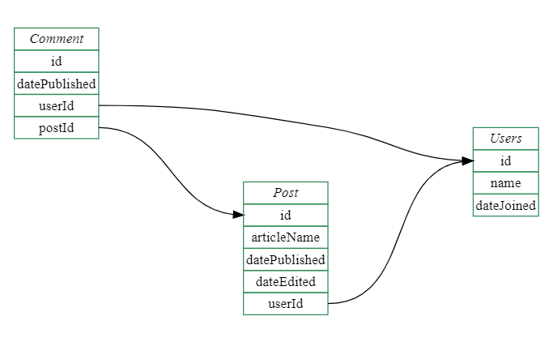

# 17. Databázové systémy

***Obsah otázky:*** Základní pojmy (databáze, pole, záznam), založení nové databáze, datové typy, základy SQL – práce s tabulkou, vyhledávání a řazení dat, dotazy, návaznost na programovací jazyky. 

## Historie
- předchůdcem byly papírové kartotéky - operace s nimi prováděl člověk fyzicky
- poté pomáhaly se zpracováním dat stroje - děrné štítky a elektromechanické počítače
- v roce 1960 vznikla první verze jazyku pro práci s databázemi **COBOL**
- začaly vznikat první **síťové** SŘBD (systém řízení báze dat = rozhraní mezi aplikačními programy a uloženými daty) na sálových počítačích
- prvním průkopníkem databází byl *Charles Bachman*
- v roce 1971 vydal výbor **Database Task Group** (DBTG - měl za úkol vytvořit koncepci databázových systémů) zprávu *The DBTG April 1971 Report*, kde se objevily pojmy jako **schéma databáze**, **jazyk pro definici schématu**, **subschéma** a podobně, byla zde popsána celá architektura síťového databázového systému
- 1970 *Edgar F. Codda* první **relační databáze**, které pohlížejí na data jako na tabulky
- 1974 se vyvíjí první verze dotazovacího jazyka **SQL** (Structured Query Language)
- v 90. letech 20. století - **objektově** orientované databáze
- vznikla **objektově-relační** technologie

## Základní pojmy
- **tabulka** - obsahuje samotná data
- **sloupec** (pole) - pole v tabulce, které má nějaký datový typ (integer, float, string (varchar), bool...)
- **databáze** - obsahuje více tabulek
- **systém řízení báze dat** (SŘBD; z angl. Database Management System - DBMS)
	- zařizuje ukládání dat a interakci s aplikacemi
	- správa klíčů, indexování
	- integrita dat, udržování unikátnosti
	- správa transakcí (napíšeme příkazy a až poté je "commitneme")
	- správa přístupu
	- příklady:
		- SQLite (bez serveru; celá databáze je jeden soubor)
		- PostgreSQL (rozsáhlé funkce, objektový model)
		- Microsoft SQL Server
		- MySQL
	- Používá je **každá** aplikace, která nějak pracuje s daty! (Bakaláři, sociální sítě...)
- **primární klíč** (primary key, PK) - hodnota nebo více hodnot, které jednoznačně určují nějaký řádek v databázi (automaticky přiřazené ID, rodné číslo...)
- **cizí klíč** (foreign key, FK) - sloupec v tabulce, který odkazuje na řádku v jiné tabulce



## SQL
- **Structured Query Language** - jazyk, pomocí kterého získáváme a zapisujeme data
- Deklarativní jazyk: zapisujeme výsledek, ne kroky, jak se k němu dostat 
- Je standardizovaný, ale různé SŘBD ho rozšiřují a upravují, aby vyhovoval jejím funkcím - příkaz napsaný pro jeden SŘBD nemusí plně fungovat v jiném

### SQL - Založení tabulky (CREATE)
```sql
CREATE TABLE kontakt (
    id INTEGER PRIMARY KEY AUTOINCREMENT,
    jmeno TEXT NOT NULL,
    prijmeni TEXT NOT NULL,
    telefon TEXT,
    ulice CHAR(80),
    mesto CHAR(80)
);

-- Pro ukázku spojování si založíme i druhou tabulku
CREATE TABLE objednavka (
    id INTEGER PRIMARY KEY AUTOINCREMENT,
    castka DECIMAL,
    kontakt_id INTEGER, -- Toto je cizí klíč (odkazuje na id v tabulce kontakt)
    FOREIGN KEY(kontakt_id) REFERENCES kontakt(id)
);
```

### SQL - Vkládání dat (INSERT)
```sql
-- Přidání jednoho nového záznamu (ID se doplní samo díky AUTOINCREMENT)
INSERT INTO kontakt (jmeno, prijmeni, telefon, ulice, mesto) 
VALUES ('Jan', 'Novák', '123456789', 'Dlouhá 5', 'Praha');

-- Vložení dat do naší druhé tabulky pro konkrétního zákazníka (s id = 1)
INSERT INTO objednavka (castka, kontakt_id) VALUES (1500, 1);
```

### SQL - Vyhledávání (SELECT a filtrace)
```sql
SELECT jmeno, prijmeni, telefon FROM kontakt WHERE id = 3; -- přímo podle ID
SELECT jmeno, prijmeni, telefon FROM kontakt WHERE jmeno = 'Daniel'; -- Jméno je Daniel
SELECT jmeno, prijmeni, telefon FROM kontakt WHERE jmeno LIKE 'd%'; -- Začíná na D (case insensitive)
SELECT * FROM kontakt WHERE mesto IN ('Praha', 'Brno'); -- Bydlí v Praze nebo Brně
```

### SQL - Řazení a Omezení (ORDER BY, LIMIT)
```sql
SELECT jmeno, prijmeni FROM kontakt ORDER BY jmeno ASC; -- Abecedně podle jména (A-Z)
SELECT jmeno, prijmeni FROM kontakt ORDER BY prijmeni DESC; -- Sestupně (Z-A)
SELECT * FROM kontakt LIMIT 5; -- Vypíše jen prvních 5 výsledků
```

### SQL - Editace dat (UPDATE)
```sql
-- POZOR: Vždy používej WHERE, jinak přepíšeš data v celé tabulce!
UPDATE kontakt 
SET telefon = '987654321', mesto = 'Ostrava' 
WHERE id = 3; 
```

### SQL - Mazání dat (DELETE)
```sql
-- POZOR: Stejně jako u UPDATE, bez WHERE smažeš úplně všechno!
DELETE FROM kontakt WHERE id = 5; 
DELETE FROM kontakt WHERE mesto = 'Praha'; 
```

### SQL - Agregační funkce (Počítání, Maximum, Minimum)
```sql
SELECT COUNT(*) FROM kontakt; -- Spočítá všechny řádky (záznamy) v tabulce
SELECT MAX(castka) FROM objednavka; -- Najde nejvyšší hodnotu ve sloupci
SELECT MIN(castka) FROM objednavka; -- Najde nejnižší hodnotu
SELECT AVG(castka) FROM objednavka; -- Vypočítá průměr
SELECT SUM(castka) FROM objednavka; -- Sečte všechny hodnoty dohromady
```

### SQL - Seskupování (GROUP BY)
```sql
-- Kolik kontaktů (lidí) bydlí v jednotlivých městech?
SELECT mesto, COUNT(id) AS pocet_obyvatel 
FROM kontakt 
GROUP BY mesto; 

-- Jaká je celková útrata (součet objednávek) pro každého zákazníka?
SELECT kontakt_id, SUM(castka) AS celkova_utrata
FROM objednavka
GROUP BY kontakt_id;
```

### SQL - Spojování tabulek (JOIN)

```sql
-- Spojí tabulku 'kontakt' a 'objednavka' dohromady pomocí shody ID (Primární klíč = Cizí klíč)
-- Tím získáme jméno člověka a k němu částku, kterou utratil, v jednom výsledku.
SELECT kontakt.jmeno, kontakt.prijmeni, objednavka.castka
FROM kontakt
JOIN objednavka ON kontakt.id = objednavka.kontakt_id;

-- LEFT JOIN (Vypíše VŠECHNY kontakty, i ty, kteří si nic neobjednali - u částky bude NULL)
SELECT kontakt.jmeno, objednavka.castka
FROM kontakt
LEFT JOIN objednavka ON kontakt.id = objednavka.kontakt_id;
```

### SQL - Transakce (Pojistka proti chybám - BEGIN, ROLLBACK, COMMIT)
```sql
BEGIN TRANSACTION; -- Začátek bloku (odteď se změny nezapisují natvrdo)

DELETE FROM kontakt; -- "Omylem" smažeme celou tabulku

ROLLBACK; -- Uf! Vrátí databázi do stavu před BEGIN TRANSACTION. Data jsou zachráněna.

-- Pokud bychom si byli jisti, že je operace správná, použijeme místo ROLLBACKu:
-- COMMIT; (Tím se změny trvale uloží)
```

### SQLite - speciální příkazy
- SQLite obsahuje příkazy začínající tečkou - ty jsou speciální a ovládají sezení v terminálu

Otevření souboru:
```sql
.open DATABAZE.DB
```

Úprava výpisu do terminálu (aby to hezky vypadalo):
```sql
.headers on  
.mode column  
.width 20 20 20
```

Příkazy pro orientaci:
```sql
.tables -- seznam tabulek
.schema -- zobrazí schéma, kterým byla DB vytvořena (např. CREATE TABLE...)
.exit   -- ukončí práci v terminálu
```

## Návaznost na programovací jazyky
- SQL příkazy můžeme generovat a spouštět z jakéhokoliv programovacího jazyka (Python, Java, PHP, C#...)
- **BEZPEČNOST (SQL Injection):** Pokud do SQL příkazu vkládáme data od uživatele (např. z přihlašovacího formuláře), je **ABSOLUTNĚ NUTNÉ** je zabezpečit (escapovat).
    - Pokud bychom vstup jen slepili do textu: `SELECT * FROM uzivatele WHERE jmeno = '` + zadane_jmeno + `'`
    - Útočník by mohl do formuláře zadat: `Admin'; DROP TABLE uzivatele; --`
    - Výsledný příkaz by pak databázi doslova zničil: `SELECT * FROM uzivatele WHERE jmeno = 'Admin'; DROP TABLE uzivatele; --'`
    - **Obrana:** Programovací jazyky řeší tento problém tzv. **parametrizovanými dotazy** (vložením zástupných znaků `?`, za které knihovna sama bezpečně a správně dosadí text).

- Další, oblíbený způsob jak interagovat s databází, je pomocí **ORM (Object-Relational Mapper)**.
    - Mapuje objekty v programovacím jazyce na SQL příkazy. Programátor tak SQL kód často vůbec nemusí psát ručně, píše jen klasický kód v daném jazyce a o bezpečný překlad do SQL se postará knihovna.

### Příklad 1: Čistý Python a SQLite (Kompletní manipulace a obrana proti SQL Injection)
Vestavěná knihovna `sqlite3` v Pythonu. Ukázka založení, vkládání, editace, mazání, agregace a bezpečí.

```python
import sqlite3

# 1. PŘIPOJENÍ (Vytvoří soubor s databází, pokud ještě neexistuje)
conn = sqlite3.connect('moje_databaze.db')
cursor = conn.cursor()

# 2. ZALOŽENÍ TABULKY (CREATE)
cursor.execute('''
CREATE TABLE IF NOT EXISTS uzivatel (
    id INTEGER PRIMARY KEY AUTOINCREMENT,
    jmeno TEXT NOT NULL,
    vek INTEGER
)
''')

# 3. BEZPEČNÉ VKLÁDÁNÍ DAT (INSERT) - Obrana proti SQL Injection!
# NIKDY NEDĚLAT TOTO: cursor.execute(f"INSERT INTO uzivatel (jmeno) VALUES ('{vstup_od_uzivatele}')")
# SPRÁVNĚ DĚLAT TOTO: Použijeme otazníky (?). Knihovna data sama a bezpečně escapuje.
novy_uzivatel = ('Daniel', 25)
cursor.execute('INSERT INTO uzivatel (jmeno, vek) VALUES (?, ?)', novy_uzivatel)

# Vkládání více řádků najednou
skupina = [
    ('Jana', 22),
    ('Petr', 30),
    ('Lucie', 22)
]
cursor.executemany('INSERT INTO uzivatel (jmeno, vek) VALUES (?, ?)', skupina)

# 4. EDITACE DAT (UPDATE)
# Změníme věk uživateli jménem Petr. Opět bezpečně přes ?.
cursor.execute('UPDATE uzivatel SET vek = ? WHERE jmeno = ?', (31, 'Petr'))

# 5. MAZÁNÍ DAT (DELETE)
# (U jednoho parametru musí být v Pythonu za hodnotou čárka, aby to byla n-tice)
cursor.execute('DELETE FROM uzivatel WHERE jmeno = ?', ('Daniel',))

# 6. VYHLEDÁVÁNÍ DAT (SELECT)
print("--- Všichni uživatelé ---")
cursor.execute('SELECT * FROM uzivatel')
for radek in cursor.fetchall():
    print(radek) # Vypíše např.: (2, 'Jana', 22)

# 7. POČÍTÁNÍ A SESKUPOVÁNÍ (COUNT, GROUP BY)
print("\n--- Počet uživatelů podle věku ---")
cursor.execute('SELECT vek, COUNT(id) FROM uzivatel GROUP BY vek')
for radek in cursor.fetchall():
    print(f"Věk {radek[0]} má celkem {radek[1]} uživatelů.")

# 8. ULOŽENÍ ZMĚN (COMMIT) A ODPOJENÍ
# Bez příkazu commit() by se žádné změny do souboru neuložily! (Využití principu transakce)
conn.commit()
conn.close()
```

### Příklad 2: Přístup přes ORM v Pythonu (knihovna peewee)
Ukázka, jak se dá stejná práce dělat zcela bez psaní SQL příkazů.
```python
from peewee import *
import datetime

db = SqliteDatabase('moje_databaze.db')

class BaseModel(Model):
    class Meta:
        database = db

# Třída v Pythonu se automaticky stane tabulkou v databázi
class User(BaseModel):
    username = CharField(unique=True)

class Tweet(BaseModel):
    user = ForeignKeyField(User, backref='tweets') # Cizí klíč a relace 1:N
    message = TextField()
    created_date = DateTimeField(default=datetime.datetime.now)

db.connect()
db.create_tables([User, Tweet])

# Vyhledání uživatele (SQL SELECT se vygeneruje na pozadí sám a zcela bezpečně)
User.get(User.username == 'charlie')
```

### Logika propojování objektů
- v ORM můžeme definovat vztahy (relace) mezi objekty, které jsou poté převedeny do logiky primárních a cizích klíčů
- vztahy mezi tabulkami:
	- **One to One** - jeden FK odkazuje na jeden PK
	- **One to Many** - více FK se odkazuje na jeden PK (jeden uživatel má několik přátel na facebooku)
	- **Many to One** - více FK se odkazuje na jeden PK (několik webových stránek má jednoho majitele)
	- **Many to Many** - více FK na více PK (několik videí má několik hashtagů)