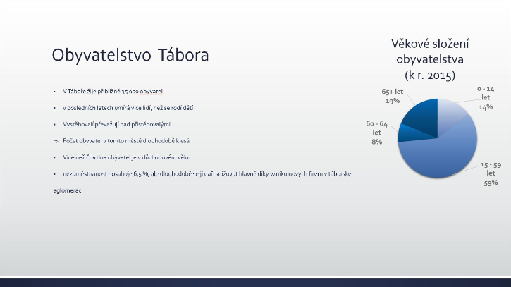
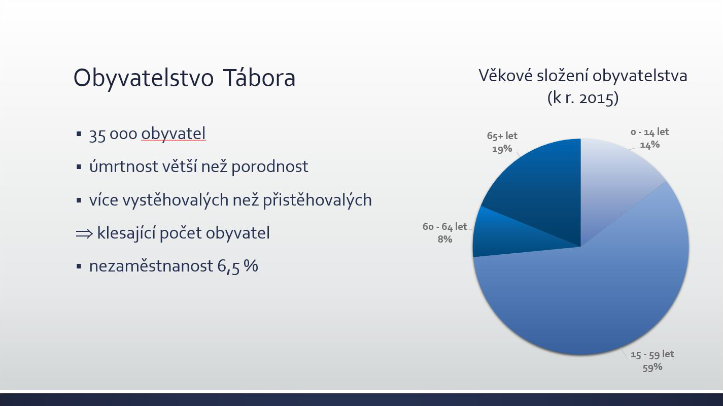

# 18. Prezentační software

***Obsah otázky:*** Popis pracovního prostředí programu Microsoft Powerpoint, tvorba snímků, animace, šablony, přechody snímků, nastavení akcí. Základy mluveného projevu při prezentování.

## Prezentační software
- počítačový program, který umožňuje vytvořit prezentaci, tj. sérii stránek neboli snímků s přehledně zobrazenými informacemi
- příklady:
    - Microsoft PowerPoint (Windows/Mac) – nejpoužívanější a nejkomplexnější
    - Apple Keynote (Mac)
    - Google Prezentace (web, mobilní telefony) – skvělé pro spolupráci více lidí v reálném čase
    - LibreOffice Impress (Linux / zdarma pro Windows)
- co všechno můžeme do prezentace vložit:
    - nadpis, text v odrážkách, tabulky
    - obrázky, ikony a 3D modely
    - SmartArt grafiky (vizuální znázornění procesů, hierarchií)
    - grafy (často přímo provázané s tabulkami v Excelu)
    - video (soubor z disku či vložené z YouTube) a audio záznamy
    - animace mezi snímky (přechody)
    - animace jednotlivých prvků na snímku

## Práce v PowerPointu
- **Rozhraní a pracovní prostředí:**
    - nahoře - **Pás karet (Ribbon):** hlavní navigační menu rozdělené na logické karty (Domů, Vložení, Návrh, Přechody, Animace, Prezentace, Zobrazení).
    - vlevo - **Miniatury snímků:** seznam snímků pro rychlou orientaci a přesouvání.
    - uprostřed - **Hlavní pracovní plocha:** samotný editovaný snímek.
    - dole - **Podokno poznámek:** prostor pro text, který při prezentování vidí jen řečník.
    - dole (stavový řádek) - přepínání zobrazení (Normální, Řazení snímků pro celkový přehled celého dokumentu, Zobrazení pro čtení).
- **Tvorba snímků a rozložení:**
    - přidání snímku - pravým kliknutím vpravo na seznam, můžeme vybrat z mnoha layoutů (rozložení - např. úvodní snímek, nadpis a obsah, porovnání, prázdný snímek...).
    - **Předloha snímku (Slide Master):** Zásadní a pokročilý nástroj! Slouží k hromadné úpravě vzhledu celé prezentace. Pokud sem vložíme firemní logo nebo změníme font nadpisu, projeví se to automaticky na všech snímcích najednou.
- **Animace:**
    - zvolíme myší objekt a v záložce animace přidáme animace. Dělí se do 4 kategorií:
        - **Vstupní (zelené):** objekt není vidět a na snímek nějakým způsobem přiletí/zobrazí se.
        - **Zvýrazňující (žluté):** objekt už na snímku je, ale např. se zvětší, zhoupne nebo změní barvu.
        - **Závěrečné (červené):** objekt ze snímku zmizí.
        - **Cesty pohybu:** objekt se přesune po námi nakreslené křivce z bodu A do bodu B.
    - **Podokno animací:** zde můžeme volně upravovat sled animací a např. zkombinovat víc animací do jednoho kroku.
    - **Časování a spouštění:** animace lze spouštět "Při kliknutí" myší, "S předchozím" (běží současně s jinou), nebo "Po předchozím".
    - **Aktivační událost (Trigger):** speciální funkce, kdy se animace nespustí běžným kliknutím kamkoliv, ale až ve chvíli, kdy řečník klikne na jeden specifický objekt (např. tlačítko na snímku).
- **Přechody snímků:** - vizuální efekt při přechodu z jednoho snímku na druhý, můžeme vybrat z mnoha animací.
    - tlačítkem "Použít na všechny" (Apply to All) ji učiníme výchozí pro celou prezentaci.
    - **Morfing (Změna):** moderní a velmi plynulý přechod, který sám analyzuje, kde byly objekty na starém snímku a plynule je přesune/změní jejich velikost na snímku novém.
    - lze nastavit časování přechodů (zda se má přejít na další snímek po kliknutí, nebo automaticky po X sekundách - vhodné pro samočinné prezentace ve výlohách).
- **Šablony a Návrh:** - **Motiv:** výběr předdefinované sady barev, fontů a efektů. Pro promítanou prezentaci (v temné místnosti) je vhodný tmavý, kontrastní motiv.
    - **Návrhy designu (Design Ideas):** funkce umělé inteligence v novějších verzích, která sama navrhne moderní a graficky přitažlivé uspořádání vložených textů a fotek.
- **Nastavení akcí a hypertextové odkazy:** - v záložce Vložení -> Akce lze objektu (např. tvaru) přidat akci při kliknutí (přehrát zvuk, spustit program...).
    - lze vytvářet interaktivní prezentace - vložená tlačítka řečníka přesunou např. rovnou na snímek 15 (přeskočí zbytek) nebo zpět na hlavní menu.
- **Videa** - V sekci vložení je možné přímo do prezentace vkládat videa z internetu, která je možné spustit během prezentace v menším okně.

## Prezentování
- **Příprava:** před napsáním prezentace se zamyslet: co je cílem? jaký rozsah pokryji? kolik na to mám času?
- na úvod uvést přehled toho, co se dozvíme; cíl prezentace.
- na závěr poděkování za pozornost, uvedení zdrojů, prostor pro dotazy.
- snímky musí logicky navazovat a jít od jednoduché informace ke komplexnější.
- **Zlatá pravidla vizuálu:**
    - pro přehlednost se můžeme řídit pravidlem **"5x5"** - maximálně 5 řádků (odrážek) na snímek a ideálně 5 slov na každém z nich.
    - používáme velké (minimálně 24b), **bezpatkové písmo** (Arial, Calibri) - patkové písmo (Times New Roman) se na dálku na plátně špatně čte a splývá.
    - pro zvýraznění používáme tučný text a barvy, vyhýbáme se podtrhávání (evokuje hypertextový odkaz) a psaní celých vět VELKÝMI PÍSMENY (působí, že na publikum křičíme).
- **Práce s publikem a přednes:**
    - při prezentování nesmíme číst snímky, ale prezentaci doplňovat. Publiku by mělo poslouchat, ne číst. Řečník je hlavní, prezentace je jen vizuální doplněk.
    - nesmíme se otáčet k plátnu zády k publiku.
    - **Zobrazení pro přednášejícího (Presenter View):** profi funkce PowerPointu. Na plátně pro publikum běží čistá prezentace, ale řečník na svém notebooku vidí aktuální snímek, náhled následujícího snímku, své tajné poznámky a stopky s časem.
- **Užitečné klávesové zkratky:**
    - **F5** - spuštění prezentace od začátku.
    - **Shift + F5** - spuštění prezentace od aktuálního snímku.
    - pokud prezentující cítí, že diváci ztrácejí pozornost, může stisknout klávesu **B (Black)** a skrýt tak dočasně obsah prezentace do černé obrazovky - publikum zpozorní a upře zrak na řečníka. Zpět se vrátí libovolnou klávesou. (Případně klávesa **W (White)** pro bílou obrazovku).

- špatná prezentace:  

- dobrá prezentace:  
