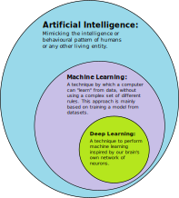

# 19. Moderní trendy v IT

***Obsah otázky:*** Mobilní technologie (GSM, mobilní sítě, mobilní zařízení), virtualizace, Cloud Computing, IoT (Internet of Things), kryptoměny, umělá inteligence (AI) a její využití v současných technologiích. Průmysl 4.0.

---

## 1. Mobilní technologie

### Systém komunikace GSM a mobilní sítě
- = **Global System for Mobile Communications** (nejrozšířenější standard pro mobilní sítě).
- **Základová stanice (BTS - Base Transceiver Station)** - umožňuje bezdrátovou komunikaci mezi uživatelským vybavením (mobily) a mobilní sítí, může mít nástroje pro šifrování.
    - systém základových stanic - BTS vytvářejí síť buněk (tzv. celulární síť) tak, aby pokryly radiovými vlnami celé území. Při pohybu si BTS předávají telefon mezi sebou bez přerušení hovoru.
- **Síťový spojovací subsystém** - zajišťuje spojování telefonních hovorů a propojování do pevných sítí a internetu.
- **HLR (Home Location Register)** - domovský registr (databáze), obsahuje detaily o všech uživatelích sítě.
    - při připojení v zahraničí je zahájen tzv. *roaming*, kdy operátor uživatele připojí do cizí sítě na základě ověření přes HLR.
- **SIM (Subscriber Identity Module)** - čipová karta; slouží k identifikaci účastníka v síti, obsahuje jednoznačné identifikační kódy (IMSI), telefonní číslo, případně kontakty a SMS. Dnes nastupuje **eSIM** (čip integrovaný přímo v telefonu).
- **Vývoj sítí:** spolíčval hlavně ve změně rychlosti.
    - **3G:** Přineslo použitelné mobilní připojení k internetu.Rychlost přibližně 1 Mbps.
    - **4G / LTE (Long-Term Evolution):** Technologie k bezdrátové komunikaci, standard pro rychlý mobilní internet (10x rychlejší načítání než 3G, spolehlivé, nízká odezva).
    - **5G:** Současný standard. Slibuje propustnost až 20 Gbit/s, obrovskou kapacitu zařízení na kilometr čtvereční a milisekundovou odezvu (nutné pro autonomní auta a Průmysl 4.0).

### Mobilní zařízení
- Chytré telefony (smartphony), tablety, chytré hodinky (wearables).
- Jsou poháněny úspornými procesory architektury **ARM** (nízká spotřeba, malý výdej tepla).
- **Operační systémy:**
    - **Android (Google):** Otevřený systém (Open Source), postavený na Linuxu, nejpoužívanější na světě.
    - **iOS (Apple):** Uzavřený systém, optimalizovaný přímo pro hardware od Applu (iPhone), vysoká bezpečnost.

---

## 2. Virtualizace a Cloud Computing

### Virtualizace
- Skrytí fyzických charakteristik výpočetních zdrojů před uživatelem. Tedy spouštění více virtuálních počítačů (operačních systémů) na jednom fyzickém stroji (serveru).
- Šetří peníze, místo a elektřinu (místo 10 fyzických serverů koupím jeden silný a vytvořím 10 virtuálních).
- **Hypervizor:** Speciální software, který přiděluje virtuálním strojům výkon (RAM, CPU) a izoluje je od sebe (např. VMware, Hyper-V).
- **Kontejnerizace (Docker):** Moderní trend. Nevirtualizuje se celý operační systém, ale jen samotná aplikace s nutnými knihovnami. Je to mnohem rychlejší a méně náročné na výkon.

### Cloud Computing
- Poskytování výpočetních služeb (servery, úložiště, databáze, sítě, software) přes internet ("cloud").
- Uživatel platí jen za to, co reálně spotřebuje (Pay-as-you-go).
- Nejrozšířenější poskytovatelé: **Amazon Web Services (AWS), Microsoft Azure, Google Cloud**.
- **Modely služeb:**
    - **IaaS (Infrastruktura jako služba):** Pronajmu si "holý" virtuální počítač a vše si na něm instaluji sám (např. AWS EC2).
    - **PaaS (Platforma jako služba):** Služba mi dá rovnou prostředí pro běh mého kódu, nemusím řešit OS (např. webhosting, Google App Engine).
    - **SaaS (Software jako služba):** Hotová aplikace přístupná přes webový prohlížeč (např. Office 365, Google Disk, Netflix).
- **Nevýhoda (Vendor lock-in):** Data a architekturu z jedné služby často nelze jednoduše převést na druhou (např. z AWS do Azure), aby si služba udržela zákazníka.

---

## 3. IoT (Internet of Things - Internet věcí)
- Označení pro síť fyzických zařízení (vozidel, domácích spotřebičů, termostatů, žárovek) vybavených elektronikou, softwarem a senzory, které umožňují propojení a vyměňování dat přes internet.
- **Komunikační protokoly:** Často nevyužívají klasickou Wi-Fi (žere moc baterie), ale úsporné protokoly jako Zigbee, Bluetooth Low Energy (BLE) nebo MQTT.
- **Zařízení na IoT prototypy:** Levné minipočítače a mikrokontroléry - např. Raspberry Pi, Arduino, Micro:Bit.
- **Smart Home (Chytrá domácnost):** Koncept, dle kterého nástroje komunikují a automatizují rutinu (např. automaticky zapni světla, když senzory zaznamenají pohyb a tmu).
    - *home-assistant.io* - populární open source infrastruktura pro smart home.
- **Bezpečnostní rizika:** IoT zařízení mají často slabé zabezpečení z výroby, mohou být hacknuta a tvořit tzv. botnety (sítě napadených zařízení zneužívané k DDoS útokům).

---

## 4. Kryptoměny a Blockchain
- Digitální platidla založená na kryptografii, existují pouze na síti.
- **Blockchain:** Základní technologie kryptoměn. Funguje jako decentralizovaná, veřejná účetní kniha (databáze). Data jsou spojena do "bloků", které na sebe kryptograficky navazují. Jakmile je blok zapsán, nelze ho zpětně smazat ani upravit.
- **Decentralizace:** Neexistuje žádná centrální banka nebo úřad, který by síť řídil. Správu zajišťují samotní uživatelé (těžaři/uzly).
- **Bitcoin (BTC):** První a nejznámější kryptoměna. Vnímán spíše jako uchovatel hodnoty ("digitální zlato"). Omezené množství (21 milionů mincí).
- **Ethereum (ETH):** Druhá největší síť. Přinesla tzv. **Smart kontrakty (chytré smlouvy)** – malé programy zapsané v blockchainu, které se automaticky spustí, pokud jsou splněny předem dané podmínky.

---

## 5. Umělá inteligence (AI)
- Obor informatiky zabývající se tvorbou systémů řešících komplexní úlohy jako např. zpracování obrazu, psaného textu, mluveného jazyka nebo plánování a řízení.
- **Strojové učení (Machine Learning):** Algoritmus, podle kterého se počítač "učí" z dat, místo aby byl natvrdo naprogramován.
    - Počítači je předložen vstup (obrázek číslice) a on odhadne výsledek. Podle toho, zda uspěl nebo ne (zpětná vazba), upravuje své vnitřní matematické parametry a zlepšuje se.
- **Hluboké učení (Deep Learning):** Využívá umělé neuronové sítě inspirované lidským mozkem. Skvělé pro analýzu fotek a rozpoznávání řeči.
- **Generativní AI:** Vytváří zcela nový obsah na základě textového vstupu (tzv. promptu).
    - Text: ChatGPT, Google Gemini.
    - Obrázky: Midjourney, DALL-E.
    - Kódování: GitHub Copilot.
- **Využití v současnosti:** Autonomní řízení (Tesla), diagnostika v medicíně (detekce nádorů z rentgenů), algoritmy na sociálních sítích (doporučování obsahu), překladače (DeepL).
- Knihovny pro AI: TensorFlow, PyTorch (pro programovací jazyk Python).

---

## 6. Průmysl 4.0 (Čtvrtá průmyslová revoluce)
- Koncept založený na nahrazení mnoha typů lidské práce plně automatizovanými a chytrými systémy (tzv. chytré továrny).
- Využívá kombinaci všech výše zmíněných trendů k maximální efektivitě.
- **Základní prvky:**
    - Autonomní roboti a kyber-fyzikální systémy (stroje řízené AI).
    - Internet věcí (IoT) a rychlé 5G sítě (stroje spolu komunikují v reálném čase).
    - **Big Data a Cloud:** Obrovské množství dat ze senzorů v továrně se ukládá do cloudu a analyzuje pro předvídání poruch (prediktivní údržba).
    - **Digitální dvojče (Digital Twin):** Virtuální 3D model reálné továrny nebo stroje, na kterém se dají simulovat změny nanečisto bez rizika.
    - **3D tisk (Aditivní výroba):** Tvorba složitých součástek přímo na míru.
- **Dopady:** Využitím automatizace a AI zaniknou statisíce málo kvalifikovaných pracovních míst, ale vzniknou nová, technicky náročnější. Výroba (tzv. offshoring) se může z Asie vracet zpět do Evropy a USA, protože stroje nepožadují mzdu.

## 7. GPS
- Funguje na základě satelitů, které vysílají svoji polohu, ale pomocí síťového připojení ji dokážeme určit rychleji.
- Tři satelity nám pak na základě vzdálenosti určí jednozančnou polohu. Vzdálenost se měří pomocí doby putování signálu.
- Služba GPS je určena hlavně pro armádu a běžní uživatelé dostávají mnohem horší službu.
- Existují 4 hlavní sítě
    - GPS - Americká, celosvětová, ale není moc přesná
    - Galielo - Evropská, přesnější, ale má málo satelitů
    - BeiDou - Čína
    - Glonass - Rusko, používá jiné kódování.