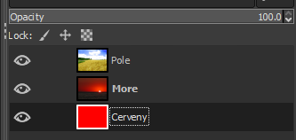

# 20. Bitmapový grafický editor a práce v programu GIMP

***Obsah otázky:*** Vrstvy a operace s vrstvami, klonovací razítko, filtry a práce s filtry, úprava fotografií (úrovně, jas, kontrast, barevné režimy, barevné modely), práce s textem.

---

## 1. Bitmapový (rastrový) grafický editor
- **K čemu slouží:** Program s grafickým uživatelským rozhraním (GUI), který se používá k tvorbě, retušování a barevným korekcím digitálních fotografií, k vytváření webové grafiky a digitální malbě.
- **Princip bitmapové (rastrové) grafiky:** - Obraz se skládá z pravidelné mřížky drobných čtverečků – **pixelů** (Picture Elements). Každý pixel nese informaci o své přesné barvě a průhlednosti.
    - **Rozlišení a datová velikost:** Kvalita obrazu závisí na rozlišení (např. 1920x1080 pixelů znamená přes 2 miliony bodů). Čím více pixelů a čím větší barevná hloubka (počet bitů na pixel), tím větší je soubor na disku.
    - **Rozdíl oproti vektorům:** Zatímco vektory (křivky) lze donekonečna zvětšovat bez ztráty kvality, bitmapa se při zvětšení **"rozpixeluje"** (začne být vidět čtvercový rastr, obraz je kostrbatý a neostrý). Bitmapy se proto nehodí pro tvorbu log a technických výkresů.
- **Příklady softwaru:**
    - **GIMP:** (GNU Image Manipulation Program) – Nejpokročilejší open-source editor zdarma. Nativní formát souborů je `.XCF` (ukládá vrstvy a rozpracovaný projekt).
    - **Adobe Photoshop:** Průmyslový standard, komerční placený software. Nativní formát `.PSD`.
    - **Krita:** Skvělý open-source editor zaměřený specificky na digitální malování a ilustrace.
    - **Photopea:** Webový editor, který běží přímo v prohlížeči zdarma a vizuálně kopíruje rozhraní Photoshopu.

---

## 2. Barevné modely a režimy
Definují matematický způsob, jakým program a hardware míchají barvy.

- **RGB (Red, Green, Blue):**
    - **Aditivní (sčítací) model:** Světlo se vyzařuje. Používá se pro vše, co svítí (monitory, televize, displeje mobilů, projektory).
    - Základem je černá barva (zhasnutý monitor). Smícháním červené, zelené a modré v plné intenzitě vznikne **čistě bílá**.
- **CMYK (Cyan, Magenta, Yellow, blacK):**
    - **Subtraktivní (odčítací) model:** Světlo se odráží od povrchu. Používá se výhradně pro **tisk na papír**.
    - Základem je bílá barva (nepotištěný papír). Smícháním azurové, purpurové a žluté vznikne tmavě hnědá, proto se přidává čtvrtý inkoust (K = Key/Black) pro ostré vykreslení černé a úsporu barev.
- **Barevné režimy:**
    - Dokument lze v GIMPu přepínat (`Horní menu: Obrázek -> Režim`). Například z RGB do **Stupňů šedi** (Grayscale), čímž se nenávratně zahodí informace o barvách a zůstane jen 256 odstínů od černé po bílou.

---

## 3. Vrstvy a pokročilé operace s nimi
Vrstvy jsou absolutním základem nedestruktivní úpravy. Fungují jako průhledné fólie naskládané na sebe. Umožňují dělat úpravy nezávisle na sobě.

- **Kde to najdu:** Dokovací panel Vrstvy se standardně nachází vpravo dole (případně `Horní menu: Okna -> Dokovatelná dialogová okna -> Vrstvy`).
- **Základní operace v GIMPu:**
    - **Plovoucí výběr:** Když do dokumentu vložíte zkopírovaný obrázek (Ctrl+V), stane se tzv. plovoucí vrstvou. Abyste mohli pokračovat v práci, musíte ji v panelu vrstev **ukotvit** (zelená kotva) ke stávající vrstvě, nebo z ní vytvořit **Novou vrstvu** (pravý klik na vrstvu -> Do nové vrstvy).
    - **Krytí (Opacity):** Posuvník v horní části panelu vrstev od 0 % (neviditelná) do 100 % (neprůhledná). Slouží k prolínání obrázků.  
    
    - **Svázání vrstev (Řetěz):** Kliknutím do prázdného políčka vedle ikony oka u vrstvy se objeví ikona řetězu. Nástrojem Přesun pak můžete posouvat více vrstev najednou jako jeden celek.
- **Pokročilé funkce:**
    - **Maska vrstvy (Pravý klik na vrstvu -> Přidat masku vrstvy):** Nedestruktivní gumování. Maska funguje jako černobílý filtr: co na masce namalujeme štětcem černě, to zprůhlední. Co je bílé, to zůstane viditelné. Kdykoliv to lze přemalovat zpět.

---

## 4. Výběry a transformace
Díky těmto nástrojům řekneme programu, se kterou přesnou částí pixelů chceme zrovna pracovat, případně jak chceme upravit plátno.

- **Nástroje výběru (Selekce):**
    - **Kde to najdu:** Panel nástrojů vlevo nahoře (nebo `Horní menu: Nástroje -> Nástroje výběru`).
    - **Přibližný výběr (Kouzelná hůlka):** Kliknutím na barvu vybere celou souvislou plochu s podobným odstínem (ideální pro mazání jednobarevného nebe nebo pozadí).
    - **Inteligentní nůžky:** Obklikáváte objekt a nůžky samy hledají kontrastní hrany (např. obrys postavy) a přichytávají se k nim jako magnet.
- **Transformace a Ořez:**
    - **Kde to najdu:** Panel nástrojů vlevo (nebo `Horní menu: Nástroje -> Nástroje transformace`).
    - **Ořez (Crop - ikona skalpelu):** Slouží k oříznutí okrajů obrázku pro vylepšení kompozice nebo odstranění rušivých elementů na krajích.
    - **Perspektiva / Škálování:** Umožňuje obrázek zvětšovat, zmenšovat nebo "narovnat" (např. padající budovy vyfocené z podhledu).

---

## 5. Úprava fotografií a retuš
Tyto nástroje se používají pro opravu chyb expozice nebo odstraňování vad na fotkách.

- **Klonovací razítko:**
    - **Kde to najdu:** Panel nástrojů vlevo (ikona tiskátka).
    - **K čemu to je:** Slouží k přesnému kopírování jedné části obrazu do jiné. Využívá se k odstranění rušivých elementů (turista u památky, akné na tváři).
    - **Jak se používá:** Podrží se klávesa `Ctrl` a klikne se levým tlačítkem na "čisté" místo. Pak se `Ctrl` pustí a tažením myši se překresluje vadné místo nabranou texturou.
- **Jas a kontrast:**
    - **Kde to najdu:** `Horní menu: Barvy -> Jas-Kontrast`.
    - **K čemu to je:** Jas posouvá barvy k bílé/černé. Kontrast roztahuje rozdíly (světlé tóny dělá světlejšími, tmavé tmavšími a odstraňuje zašedlost).
- **Úrovně (Levels):**
    - **Kde to najdu:** `Horní menu: Barvy -> Úrovně`.
    - **K čemu to je:** Profesionální oprava expozice. Pracuje s **Histogramem** (graf rozložení tónů). Pomocí posuvníků můžeme definovat absolutní černou, čistě bílou a střední tóny nezávisle na sobě.
- **Křivky (Curves) – Nejmocnější nástroj úprav:**
    - **Kde to najdu:** `Horní menu: Barvy -> Křivky`.
    - **K čemu to je:** Ultimátní kontrola nad světlem a barvou. Místo posuvníků máme diagonální čáru v grafu. Tažením čáry nahoru vybraný tón zesvětlujeme, tažením dolů ztmavujeme. Lze dokonce přepnout do jednotlivých RGB kanálů a upravit jen barvy (například do tmavých stínů na fotce přidat filmový modrý nádech).

---

## 6. Filtry
Filtry procházejí obrázek pixel po pixelu a mění je podle předdefinovaných algoritmů.

- **Kde to najdu:** Vše je v `Horním menu: Filtry`.
- **Rozostření (Blur):** Nejpoužívanější je **Gaussovské rozostření** (`Filtry -> Rozostření -> Gaussovské...`). Využívá se k umělému rozmazání pozadí pro vyniknutí hlavního objektu.
- **Doostření (Unsharp mask):** (`Filtry -> Vylepšení -> Doostřit...`). Hledá hrany a uměle na nich zvýší kontrast, čímž oklame lidské oko a fotka působí ostřeji.
- **Umělecké filtry:** Dokáží fotku převést na olejomalbu (`Filtry -> Umění -> Olejomalba`), komiks, nebo generovat textury (např. plameny nebo mraky).

---

## 7. Práce s textem (Typografie v bitmapě)
- **Kde to najdu:** Nástroj Text (`ikona A` v levém panelu nástrojů).
- **Jak to funguje:** Kliknutím do plátna se automaticky vytvoří speciální **Textová vrstva**. Dokud je text textovou vrstvou, lze ho libovolně přepisovat.
- **Možnosti nastavení (zobrazí se v panelu Volby nástroje):**
    - **Font a velikost:** Výběr z nainstalovaných písem a nastavení velikosti (px).
    - **Zarovnání a barva:** Nastavení barvy textu a zarovnání (vlevo, vpravo, střed, do bloku).
    - **Proklad znaků:** Upravuje mezery mezi jednotlivými písmeny (často se zvětšuje u nadpisů).
    - **Řádkování:** Definuje svislou mezeru mezi řádky v rámci odstavce.
- **Rasterizace (Sloučení):** Jakmile chcete na text použít bitmapový filtr (např. rozmazání), musíte vrstvu sloučit (převést na pixely). Od té chvíle už text nelze přepisovat jako ve Wordu!