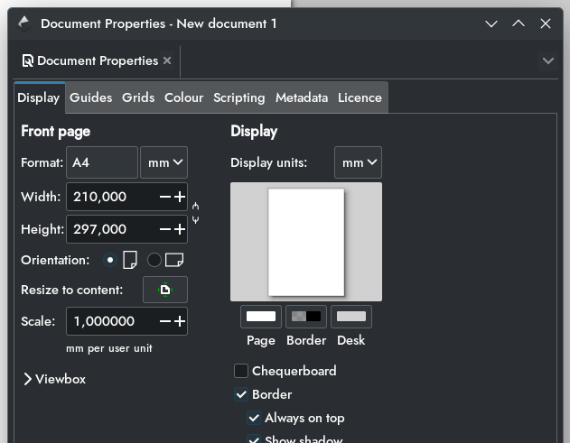

# 21. Vektorový grafický editor

***Obsah otázky:*** prostředí programu, nastavení kreslící plochy, práce s textem, úpravy objektů, vrstvy

### K čemu slouží a jak se liší od bitmapy
- **Vektorový grafický editor:** Program určený k tvorbě a úpravě vektorové grafiky (počítačové ilustrace, loga, ikony, typografie, technické výkresy, letáky).
- **Rozdíl oproti bitmapě (rastru):**
    - **Bitmapa:** Obraz je tvořen mřížkou barevných bodů (pixelů). Při zvětšení se obraz "rozpixeluje" a ztratí kvalitu. Má velkou datovou velikost. 
    - **Vektor:** Obraz není tvořen pixely, ale přesnými matematickými rovnicemi (body, přímkami, křivkami a mnohoúhelníky). 
    - **Hlavní výhoda:** Je absolutně **škálovatelný** – logo můžeme zvětšit na velikost vizitky i billboardu a kvalita bude pořád stoprocentně ostrá. Datová velikost souboru je navíc velmi malá.
    - **Nevýhoda:** Naprosto nevhodné pro ukládání reálných fotografií (příliš složité barevné přechody).

### Zástupci vektorových grafických editorů
- **Inkscape:** Náš hlavní program. Je zdarma (Open-source), výborný na SVG formát.
- **Adobe Illustrator (AI):** Průmyslový standard pro profesionály, komerční placený software.
- **CorelDRAW:** Tradiční komerční program, oblíbený v tiskařství a signmakingu (řezané reklamy).
- **Zoner Callisto:** Starší český vektorový editor (dnes už překonaný, ale u maturity se občas zmiňuje).
- **Figma / Adobe XD:** Moderní vektorové editory zaměřené primárně na design webů a aplikací (UI/UX).

### Jakým způsobem jsou popisovány křivky?
- Křivky jsou definovány matematicky, nejčastěji pomocí tzv. **Bézierových křivek**.
- Každá křivka se skládá z:
    - **Uzly (Kotevní body):** Body, kterými křivka prochází nebo kde začíná a končí.
    - **Táhla (Směrové vektory):** Přímky vycházející z uzlů. Délka a úhel těchto táhel určují, jak moc a jakým směrem se bude křivka prohýbat.
- **Formáty souborů:**
    - **SVG (Scalable Vector Graphics):** Nejpoužívanější webový formát. Je založený na jazyce XML (dá se otevřít v poznámkovém bloku jako kód). Prohlížeče ho umí číst nativně. Nativní formát Inkscapu.
    - **PDF (Portable Document Format):** Ideální pro tisk, drží rozložení i fonty.
    - **EPS (Encapsulated PostScript):** Starší, ale stále používaný tiskový formát.
    - **.AI / .CDR:** Proprietární formáty Illustratoru a Corelu.

---

## Nastavení kreslící plochy
- File -> Document properties (Soubor -> Vlastnosti dokumentu)  
	
	- Nastavení velikosti stránky, jednotek...
	- Metadata (Autor dokumentu, licence...)
- na plochu můžeme přidávat vodítka tažením z pravítka na okraji obrazovky
	- dvojklikem na vodítko můžeme přesně nastavit umístění, rotaci, nebo vodítko odebrat
	- Edit -> Delete all guides odstraní všechna vodítka

## Práce s objekty
- vlevo můžeme vytvořit kruh, elipsu, obdélník, hvězdu, n-úhelník...
	- tímto se vytvoří objekt - nahoře přes Path -> Object to path (Cesta -> Objekt na cestu) můžeme převést na generickou křivku, jejíž body můžeme upravovat
- objekty můžou přiléhat k vodítkům a jiným objektům zapnutím snappingu vpravo (v novějších verzích vpravo nahoře) 

## Práce s textem
- vlevo můžeme přidat text a psát
- nahoře můžeme nastavit písmo, velikost písma
- v nabídce Text -> Put on path můžeme text umístit na nějakou křivku, ve stejné nabídce lze i odebrat
- i text můžeme převést na generickou křivku podle postupu v předchozí sekci
	- tímto nemusí ten, kdo si SVG prohlíží, mít font který jsme použili (ve výchozím stavu se text ukládá jako text, křivku sice nemůžeme bez OCR vrátit zpět na text, ale je zachován tvar jednotlivých písmen)
- v nabídce Text -> Flow into frame můžeme vynutit text, aby se zalamoval podle nějakého objektu

# Práce s vrstvami
- Ctrl+Shift+L otevře nabídku vrstev
- Vrstvy lze pojmenovávat, přesouvat a zamykat pro snadnější organizaci objektů
- I objekty lze pojmenovávat
