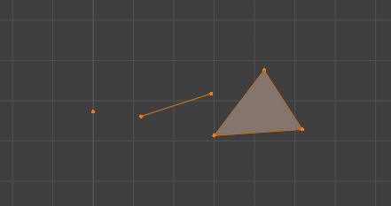
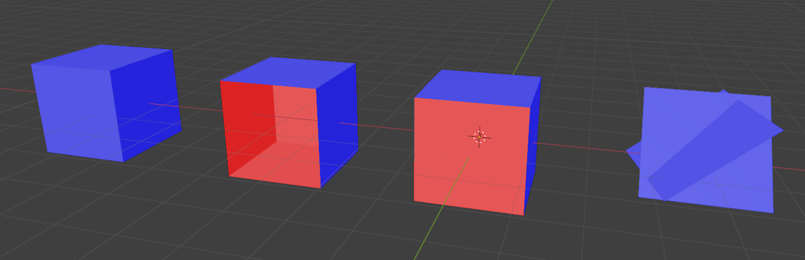
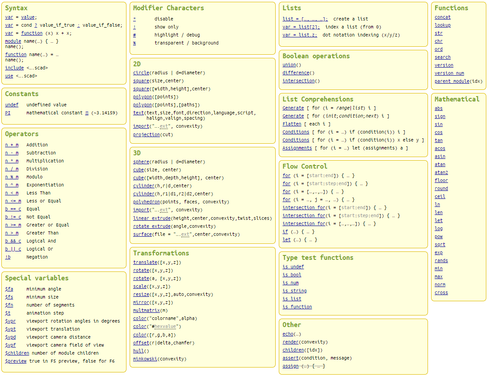

# 22. Práce s prostorem

***Obsah otázky:*** 3D modelování a 3D tisk; principy a používané technologie

## Modelování
- **CAD** (Computer Aided Design) - software používaný pro tvorbu 3D modelů (objektů)
    * Autodesk TinkerCAD - velmi jednoduchý CAD software pro tvorbu modelů, běží v prohlížeči
    * OpenSCAD - open source CAD SW, který vytvýří předměty na základě skriptu (ve vlastním p. jazyce)
    * Blender - open source program pro 3D tvorbu obecně, použití spíše pro rendery
- Model se skládá z:
    * Vrcholů (vertex/vertices) - Body v 3D prostoru
    * Hran (edge/s) - Propojení dvou vrcholů
    * Stran (face/s) - Propojení několika hran v stranu  

- Modely ukládáme nejčastěji do souboru .STL (standard triangle language), který je univerzální a nejpoužívanější
    * při uložení dojde k triangulaci modelu - strany jsou rozděleny na trojúhelníky
    * další formáty: .DAE (Collada, založený na XML), .OBJ, .FBX
- Požadavky na 3D model k tisku:
    * Model musí být tzv. manifoldní, tedy být uzavřeným objektem, který by šlo teoreticky rozložit jako papír (představte si to jako "kříž" který vznikne, když rozložíte krychli)  
    * Nesmí se překřižovat strany  
      
    * Příklady chybných modelů. Zleva doprava: Model bez chyb; model s chybějící stranou; model, jehož strany mají odlišné normály; překřižující se strany

## Tisk
- Tiskárny se většinou skládají ze tří částí:
    - tisková hlava
    - tištěný objekt
    - tisková plocha
- Laické tiskárny tisknou především z plastů:
    - PLA (PolyLactic Acid) - netoxický, biologicky odbouratelný plast vhodný pro dekorace, hračky aj. předměty, tisk při ~200˚C
    - PETG (PolyEthylene Terephthalate Glycol) - pevnější plast s podobnými vlastnostmi jako PLA, tisk při ~240˚C
    - ABS (Acrylonitrile Butadiene Styrene) - jeden z prvních plastů, lepší vlastnosti než PLA, ale toxický (zapáchá při tisku a musí se ventilovat), tisk při ~230˚C
- Profesionální tiskárny třeba i různé kovy (hliník, měď, ocel, titan), beton - stavba domů, sklo
- Typy 3D tiskáren
    - a) **Aditivní** - materiál je přidáván, nanášen
    - b) **Subtraktivní** - materiál je ubírán, vrtán
- Dělení podle nanášení materiálu:
    - **FDM - Fused deposition modeling** - hlavice cestuje po desce a vytláčí roztavený plast, nejčastější
    - SLS - Selective Laser Sintering - spékání materiálu UV zářením
    - Stereolitografie - tvrzení fotopolymeru UV zářením, jedna z prvních technologií 3D tisku (patent Chuck Hull 1986), mezitím ponoření objektu do tekutiny pro nabrání další vrstvy
    - 3DCP - práškový materiál a tekutý spojovač (patent MIT 1993)
- Tiskárna nerozumí 3D modelům, model musí "předžvýkat" tzv. **Slicer** - dostaneme gcode
    - program, který umí model načíst a převést ho na formát pro 3D tiskárny
    - rozdělí model na jednotlivé vrstvy, které tiskárna vytváří
    - **Podpory** - Model je tisknut zespoda vzhůru a materiál nemůže jen tak "viset" - Slier musí vygenerovat podpůrné struktury, které po vytisknutí odstraní člověk
    - příklady: Ultimaker Cura, PrusaSlicer
- Důležitá nastavení při 3D tisku:
    - Teplota plastu při tisku, teplota podložky, na kterou je plast nanášen
    - Rychlost pohybu
    - Poměr vyplňování (šetření materiálu tím, že vnitřek předmětu není 100% vyplněn plastem)
- V České republice - **Prusa Research**
    - firma vývojáře Josefa Průši
    - 2. největší výrobce domácích 3D tiskáren na světě
    - jejich tiskárny jsou open source hardware
    - konkurence čínskému gigantu Bambu Lab

## OpenSCAD
- Používá hlavně tři Booleovské operace se základními objekty, **primitvy**: koule, krychle, válec, kužel
    - sjednocení
    - rozdíl
    - průnik




```openscad
// ==========================================================
// 1. GLOBÁLNÍ NASTAVENÍ A PROMĚNNÉ
// ==========================================================

// $fn definuje rozlišení křivek (počet segmentů na kružnici)
$fn = 50; 

// Parametry, které můžeme snadno měnit na jednom místě
sirka_zakladny = 40;
vyska_sloupu = 30;
polomer_koule = 8;


// ==========================================================
// 2. ZÁKLADNÍ PRIMITIVA A TRANSFORMACE
// ==========================================================

// KRYCHLE (CUBE)
// translate([x, y, z]) posouvá objekt v prostoru
color("SlateBlue")
translate([-50, 0, 0]) 
    cube([20, 20, 10], center=true);

// KOULE (SPHERE)
// scale([x, y, z]) mění proporce (zde vytvoříme elipsoid)
color("IndianRed")
translate([-50, 30, 0])
    scale([1, 1.5, 0.8])
    sphere(r=10);

// VÁLEC A KUŽEL (CYLINDER)
// r1 je poloměr spodní podstavy, r2 horní. Pokud r2 = 0, vznikne kužel.
color("MediumSeaGreen")
translate([-50, -30, 0])
    rotate([0, 0, 0]) // rotace kolem os (ve stupních)
    cylinder(h=15, r1=10, r2=0, center=false);


// ==========================================================
// 3. BOOLEOVSKÉ OPERACE (Difference, Union)
// ==========================================================

// Difference: od prvního objektu odečte všechny následující
translate([0, 40, 0])
difference() {
    // Hlavní tělo
    cube([20, 20, 20], center=true);
    
    // Vyříznutí otvorů pomocí válců
    cylinder(h=30, r=6, center=true);
    rotate([90, 0, 0]) cylinder(h=30, r=6, center=true);
    rotate([0, 90, 0]) cylinder(h=30, r=6, center=true);
}


// ==========================================================
// 4. MODULY (Vlastní funkce)
// ==========================================================

// Modul pro opakované generování složitějšího objektu
module sloup_s_kouli(vyska, polomer) {
    cylinder(h=vyska, r=polomer/2);
    translate([0, 0, vyska])
        sphere(r=polomer);
}


// ==========================================================
// 5. MATEMATIKA, CYKLY A ROZMÍSTĚNÍ
// ==========================================================

// Použití cyklu FOR a goniometrických funkcí (SIN, COS)
// Rozmístíme 8 sloupů do kruhu

pocet_clenu = 8;
polomer_kruhu = 30;

for (i = [0 : pocet_clenu - 1]) {
    // Výpočet úhlu pro každý člen
    uhel = i * (360 / pocet_clenu);
    
    // Výpočet pozice X a Y na kružnici pomocí sinu a kosinu
    posun_x = polomer_kruhu * cos(uhel);
    posun_y = polomer_kruhu * sin(uhel);
    
    // Dynamická výška sloupu pomocí funkce sin(uhel)
    // Výška se bude měnit vlnovitě podle pozice
    vlastni_vyska = 15 + sin(uhel * 2) * 10;

    translate([posun_x, posun_y, 0])
        color([0.2, 0.5, i/pocet_clenu]) // Dynamická změna barvy (RGB)
        sloup_s_kouli(vyska=vlastni_vyska, polomer=4);
}

// Základová deska pod sloupy
color("LightGray", 0.5) // Průhlednost 0.5
translate([0, 0, -2])
    cylinder(h=2, r=polomer_kruhu + 10);
