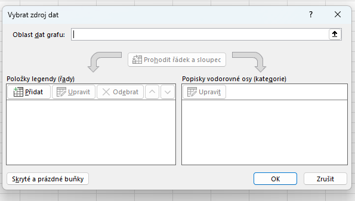

# 25. Tabulkové kalkulátory

***Obsah otázky:*** prostředí programu, výběr buněk, formát buňky, automatický formát tabulky, podmíněné formátování, vzorce a funkce, absolutní a relativní adresování, tvorba grafů, filtry a řazení dat, funkce data a času, zamknutí listu, funkce najít a nahradit

## Tabulkový kalkulátor
- program určený pro zpracování textových a numerických dat (statistika, vizualizace, výpočet)
- hlavně pro **účetnictví**, **ekonomii**, **vědu**
- jeden z prvních typů programů, co vznikl pro stolní počítače
- formáty: xls, xlsx (založený na zazipovaných xml souborech), ods

## Využití Excelu
- **podnikání a finance:** vystavování faktur, vedení firemního účetnictví, výpočty mezd, tvorba rozpočtů a finančních plánů
- **analýza a správa dat:** zpracování rozsáhlých databází (evidence zaměstnanců, skladové zásoby, seznamy klientů), čištění duplicitních dat
- **věda a výzkum:** provádění složitých statistických, inženýrských nebo matematických výpočtů, vizualizace naměřených dat z experimentů
- **osobní využití:** plánování rodinných financí, evidence tréninků, organizace událostí (seznam hostů a nákladů)
- **automatizace:** tvorba interaktivních formulářů, dashboardů (přehledových řídících panelů) a automatizace rutiny pomocí maker (programování ve VBA)

## Práce v programu Excel
- **prostředí programu:** využívá tzv. Pás karet (Ribbon) rozdělený na záložky (Domů, Vložení, Vzorce atd.) a Řádek vzorců (zobrazuje skutečný obsah buňky, např. vzorec, zatímco v tabulce vidíme jen výsledek)
- soubory nazýváme "sešity", 1 soubor = 1 sešit
- možnost přidávat listy ("záložky") - lišta dole
- buňky
    - sloupce písmenka, řádky číslice
    - **výběr buněk:**
        - souvislá oblast: tažením myší (např. A1:C10) nebo pomocí klávesy Shift
        - nesouvislá oblast: držením klávesy Ctrl a klikáním (např. A1; C5)
        - celé sloupce/řádky kliknutím na jejich záhlaví (písmeno/číslo), případně vše zkratkou Ctrl+A
    - buňky můžou být různých datových typů (datum, číslo, text, měna) a formátování (symbol měny, mezery v čísle pro oddělení tisíců, počet desetinných míst)
    - **formát buňky:** řeší pouze vizuální podobu dat (barvy, ohraničení, písmo) bez změny skutečné hodnoty uvnitř
    - možnost použít funkce (`=NÁZEVFUNKCE()`) pro dynamickou práci s daty
    - **vzorce a funkce:** každý výpočet musí začínat rovnítkem `=`. Vzorec je matematický zápis (např. `=A1+B1*2`), funkce je předpřipravený nástroj Excelu (např. `=SUMA()`).
    - reference na bunky pomocí jejich adres
        - **relativní adresování:** odkaz se při kopírování buněk automaticky posouvá a mění (např. A1 se při zkopírování o řádek níž změní na A2)
        - adresace pomocí písmene (sloupec) a čísla (řádky)
        - můžeme před buď písmeno, nebo číslo, nebo obojí (též zkratka F4) napsat $ a udělat z ní absolutní adresu (nemění se při "rozšiřování" dat dole v pravém rohu)§
        - **absolutní adresování:** odkaz je pevně zafixován právě pomocí znaku dolaru (např. `$A$1` - fixní sloupec i řádek, `$A1` - fixní jen sloupec) a při kopírování se nemění. Využívá se např. při násobení celé tabulky jedním fixním kurzem měny.

### Automatický formát tabulky a podmíněné formátování
- **automatický formát tabulky:** (volba Formátovat jako tabulku na kartě Domů) převede obyčejná data na dynamický objekt – automaticky přidá filtry, při scrollování dolů udržuje viditelné hlavičky sloupců, automaticky kopíruje vzorce do celého sloupce a při přidání dat se sama rozšíří.
- **podmíněné formátování:** dynamicky mění vzhled buňky podle její aktuální hodnoty (např. buňky s hodnotou pod 1000 automaticky zčervenají, přidá barevné škály / heatmapy nebo vykreslí malé sloupcové grafy přímo uvnitř buněk na pozadí čísel).

### Filtry a řazení dat
- **řazení:** uspořádání dat vzestupně (A-Z, od nejmenšího po největší) nebo sestupně (Z-A). Lze řadit víceúrovňově (např. primárně podle Oddělení a sekundárně podle Platu).
- **filtry:** přidají šipky do hlaviček, přes které lze dočasně skrýt řádky, které nesplňují požadované podmínky (např. zobrazit jen obyvatele Prahy). Data se nemažou, jen nejsou vidět.

### Kontingenční tabulky (Pivot Tables)
- extrémně mocný nástroj pro rychlou analýzu a sumarizaci obrovského množství dat (záložka *Vložení* -> *Kontingenční tabulka*).
- nevyžaduje psaní žádných složitých funkcí (jako např. SUMIFS).
- uživatel pouze myší přetahuje názvy sloupců (polí) do 4 specifických oblastí:
  1. **Řádky:** podle čeho chceme data seskupit (např. Rok, Město).
  2. **Sloupce:** tvoří křížovou tabulku (např. Kategorie produktů).
  3. **Hodnoty:** co chceme počítat. Většinou se data automaticky sečtou (Suma tržeb) nebo se spočítá jejich počet.
  4. **Filtry:** celkový filtr aplikovaný na celou vygenerovanou tabulku.

### Funkce najít a nahradit
- zkratky Ctrl+F (Najít) a Ctrl+H (Nahradit)
- **najít:** bleskově vyhledá konkrétní text či číslo na aktuálním listu nebo v celém sešitu.
- **nahradit:** najde určenou hodnotu a hromadně ji přepíše na jinou (velmi často se používá pro záměnu teček za desetinné čárky u importovaných dat, aby s nimi mohl český Excel vůbec počítat).

### Některé funkce
- `RANDBETWEEN()` - náhodné číslo
- `SUMA()` - sečíst hodnoty v rozsahu buněk
- `MIN()`, `MAX()` - nejmenší/nejvyšší hodnota v rozsahu
- `PRŮMĚR()` - aritmetický průměr hodnot v rozsahu
    - Pokud je výsledek periodické číslo (např. 26,666667), je vhodné buňku označit a v nabídce formát buněk omezit počet desetinných míst
- `RANK()` - určí pořadí buňky v širší oblasti - "žebříček" hodnot, kde 1 je nejvyšší
    - pozor, `RANK()` je legacy funkce - v moderním excelu použít `RANK.EQ()`
- **funkce data a času:** datum je v Excelu interně uloženo jako číslo (počet dní od 1. 1. 1900), proto s ním lze matematicky počítat (např. odečítat datumy). Základní funkce jsou `=DNES()` (aktuální datum), `=NYNÍ()` (aktuální datum i s přesným časem), `=ROK()`, `=MĚSÍC()`, `=DEN()`.

### Tvorba grafu
- Graf přidáme ve Vložení -> Grafy
- Data (vlevo) a popisky (vpravo) přidáme praým kliknutím v množnosti přidat data
- **Základní typy grafů:**
  - *Sloupcový / Pruhový graf:* ideální pro porovnávání velikosti hodnot mezi různými kategoriemi (např. tržby v jednotlivých měsících).
  - *Spojnicový graf:* ukazuje vývoj a trendy v plynulém čase (např. vývoj teploty během dne nebo kurzu akcií).
  - *Koláčový (Výsečový) graf:* znázorňuje procentuální podíl jednotlivých částí na jednom celku (např. podíl značek na trhu).
  - *Bodový (XY) graf:* zobrazuje vztah mezi dvěma číselnými proměnnými.

- při dvojkliku na graf se vpravo objeví nabídka formátování - můžeme upravit vzhled grafu (barvy, osy, legendu, popisky dat)

### Ochrana proti úpravám (Zamknutí listu)
- V záložce revize lze zamnkout list či celý sešit
- slouží k ochraně před nechtěným přepsáním struktury, vzorců a dat, lze chránit heslem
- Lze **přidat výjimky** (např. pokud tvoříte dotazník, můžete v nastavení "Formát buněk -> Ochrana" odemknout jen konkrétní žluté buňky a následně zamknout list – uživatel pak bude moci psát pouze do povolených buněk)